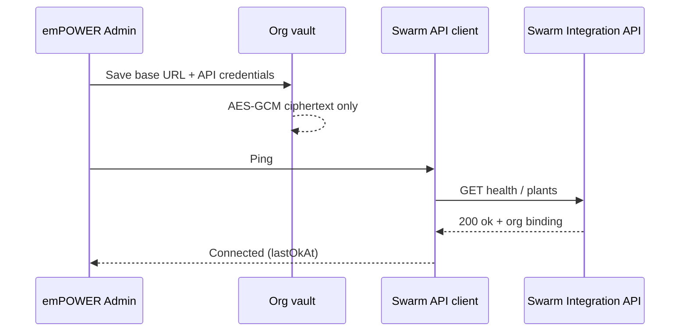
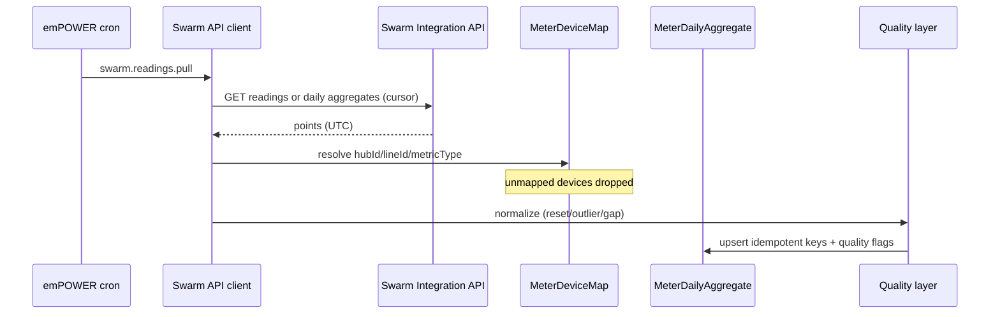
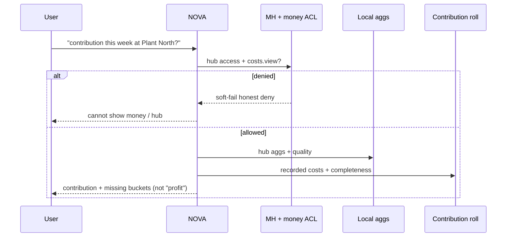
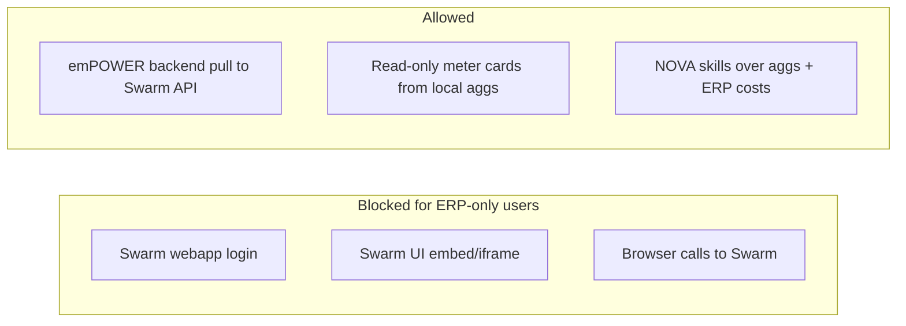

# emPOWER × SWARM Integration Architecture

**Audience:** Swarm / nanoFarm developer team + emPOWER ERP team  
**Date:** 2026-07-22  
**Status:** Architecture decision + team reply (docs only — not a production tip)  
**Commit branch:** `docs/manufacturing-hub-plan`

### Sources reviewed

| # | Source | What it is |
|---|--------|------------|
| S1 | `/Users/mike/Downloads/swarm_co_in_Integration_Plan.pdf` | PDF “swarm.co.in Platform Master Integration Plan” (12 pages, 22 Jul 2026) |
| S2 | `/Users/mike/Downloads/empower_swarm_integration_338468db.plan.md` | Cursor plan — same blueprint as S1 in markdown form |
| S3 | `/Users/mike/Downloads/SWARM_Project_Working_Flow.pdf` | Swarm product working flow (standalone React + Spring IoT app) |
| S4 | `docs/MANUFACTURING_HUB_PLAN.md` (rev 4) | emPOWER Manufacturing Hub plan — P2 = Swarm **API client only** |
| S5 | `/Users/mike/Downloads/cursor_empower_integration_plan.md` | Swarm team follow-up plan (Partner API + API keys) — **aligned**; see §F |

**Paste-ready reply to S5:** `docs/SWARM_TEAM_PLAN_REVIEW_REPLY.md` (mirror: `/Users/mike/Downloads/SWARM_TEAM_PLAN_REVIEW_REPLY.md`)

---

## A. Verdict (for Mike / leads)

### A0. Swarm team follow-up plan (S5) — primary score for current reply

**Score: 8.5 / 10** for S5 against S3+S4 and Mike’s ownership decision.

S5 correctly treats Swarm as **standalone**, emPOWER as **API client**, Partner `/partner/v1` with org API keys, pull-first, no UI embed, no Central Auth on emPOWER for P2. Remaining fixes: rename misleading “bi-directional” Phase 2, elevate daily aggregates priority, stop re-asking decided questions, clarify MH RBAC is emPOWER-only. Full wrong→right list + paste reply: `docs/SWARM_TEAM_PLAN_REVIEW_REPLY.md`.

### A1. Earlier unified-platform blueprint (S1+S2) — historical

**Score: 5.5 / 10** for S1+S2 as an *integration* plan against S3+S4 and Mike’s ownership decision.

**S1 and S2 are essentially the same document** (PDF export ↔ Cursor plan). Scoring them once is enough. **Superseded for implementation intent by S5** where S5 conflicts with S1’s unified-platform language.

### What’s strong (keep)
- **Server-to-server only:** ERP browser must never call Swarm; backend proxy / client is correct (S1 §5, S2).
- **No Swarm UI embed** in ERP; ERP-only users must not get Swarm login (S1 hard rules).
- **Normalized telemetry envelope** + OpenAPI-first gateway routes are a good *Swarm-owned* API shape.
- **Nova must not hit Swarm DB** — tools go through emPOWER (skills / proxy) — correct.
- **Tenant `org_id` on telemetry** and isolation tests — right long-term direction.
- S3 correctly describes Swarm as its **own** product (pairing, ingest, alerts, AI health) — that ownership should stay.

### What’s wrong (must correct)
- S1/S2 treat **swarm.co.in as a unified platform SaaS engine** that co-owns emPOWER + Swarm + Universal Telemetry. **Mike override:** Swarm is a **separate standalone app**; emPOWER **only consumes Swarm’s API**. Do not build Swarm (or a Universal Telemetry Engine) inside `empower-erp`.
- S1 Phase 1 puts **Central Auth API + Super Admin console on emPOWER** and makes emPOWER **authoritative** for `UserProductAccess` / plant assignments mirrored into Swarm. That merges identity products — **out of scope for MH P2** and conflicts with S3’s own login/roles.
- “**ERP → SWARM blocked**” is overstated. Correct: **users** don’t get Swarm UI/login; **emPOWER backend must call Swarm** (pull / partner API).
- S1/S2 omit Manufacturing Hub truths from S4: hub-scoped RBAC (Manager deny), contribution ≠ profit, quality flags / totalizers / timezone, meter→hub maps, NOVA soft-fail.
- S1 Phase 3 (EMQX, Universal Device Adapter, cloud ESP pairing) belongs to **Swarm team**, not emPOWER.
- S1 repo table lists “emPOWER ERP + **Super Admin**” as if platform provisioning lives in ERP — wrong for standalone Swarm.

### Bottom line
Keep the **API-only / no-embed-UI / Nova-via-ERP** instincts from S1. Drop the **unified-platform build** and any plan that develops Swarm or the telemetry ingest engine inside emPOWER. Swarm publishes a partner Integration API; emPOWER Manufacturing Hub P2 is the **client**.

---

## B. Corrections list (wrong → right)

### Ownership boundaries

| Wrong (S1/S2) | Right |
|---------------|-------|
| swarm.co.in = one platform that builds ERP + Swarm + Universal Telemetry | **Two products.** Swarm standalone (other team). emPOWER integrates via API only |
| Telemetry Gateway + IoT ingest + adapters in shared “platform” work with emPOWER | **Swarm owns** ingest, Timescale, adapters, ESP/MQTT, plant UI |
| Super Admin console in emPOWER grants `swarm_access` / plant_ids | Swarm keeps its own admin/roles (S3). emPOWER Admin stores **org API credentials** + MH hub membership |
| Universal Device Adapter Phase 3 as shared platform | **Swarm roadmap**; emPOWER only maps new `device_type`s when they appear in the API |
| emPOWER builds Swarm / firmware / SCADA | **Never** in `empower-erp` |

### Auth / multi-tenant / org vault

| Wrong | Right |
|-------|-------|
| HttpOnly `.swarm.co.in` cookie is required emPOWER session (S1 §4–5) | emPOWER keeps its own session (`erp.empowerbpg.com` / future SaaS). Optional SSO later — **not P2 blocker** |
| Central Auth API **on emPOWER** for both products (S1 Phase 1) | Each product auth for now; Swarm portal auth is **Swarm’s** problem |
| emPOWER authoritative for Swarm plant assignments (S1 §10) | Swarm is SoT for plants/devices; emPOWER maps external IDs → hubs |
| Service JWT from emPOWER as only auth model | Prefer **org-scoped Swarm API key / OAuth client** in emPOWER **org vault**; JWT OK if Swarm issues it |
| Manager ≈ Plant Admin | Different products. emPOWER **Manager denied MH by default** |

### Telemetry quality / totalizers / timezone

| Wrong | Right |
|-------|-------|
| Latest reading / normalized JSON alone is enough for costing | Persist **quality flags** on readings + daily aggs |
| Gaps → zeros | **No zero-fill**; `INCOMPLETE` |
| Ignore totalizer resets | `RESET_DETECTED`; safe deltas |
| Server-local “daily” | Store **UTC**; hub timezone on aggs |

### Mapping devices → hubs / lines / meters

| Wrong | Right |
|-------|-------|
| Company ↔ `swarm_plant_id` alone (S1 data model) | Explicit **MeterDeviceMap**: device → `hubId` / `lineId` / `metricType` |
| Unmapped devices into Nova | **Unmapped = ignored** |
| Embed Swarm dashboards | Read-only cards from **pulled aggs** only |

### Costing

| Wrong | Right |
|-------|-------|
| Sensor cards imply plant P&L / profit | **Swarm = physical truth**; **ERP docs = money truth**; join = **contribution / cost-per-unit / completeness** — never bare “profit” |

### RBAC (emPOWER)

| Wrong | Right |
|-------|-------|
| ERP-only ⇒ full IoT + Nova telemetry (S1 matrix) without hub ACL | Still need **MH hub membership** / grants; Manager default deny |
| Org-wide manufacturing read | No membership + no `hub.read.all` = **no hub data** |
| Costs for all MH users | `manufacturing.costs.view` money-adjacent (prefer SA) |

### NOVA

| Wrong | Right |
|-------|-------|
| Live proxy every Nova call to Swarm `/internal/*` as only path | Prefer skills over **local quality-flagged aggs** (fed by pull); live proxy optional; **read-only + soft-fail** |
| “Is the plant profitable?” | Contribution / completeness language |

### Incorrect Swarm / platform logic

| Source | Issue | Correction |
|--------|-------|------------|
| S3 | `POST /api/iot/batch` Public | OK for ESP LAN; **partner API for emPOWER must be authenticated + org-scoped** |
| S3 | LAN Connect Device | Swarm product only; emPOWER never proxies pairing |
| S1 | “One-way ERP→SWARM blocked” including backend implication | Backend **pull required**; block is **UI/login** only |
| S1 | Timescale + EMQX as emPOWER-adjacent platform tasks | Swarm infrastructure |

---

## C. Conflict matrix (S1 × S2 × S3 × S4)

| Topic | S1 PDF | S2 plan.md | S3 Working Flow | S4 MH plan rev 4 | Resolution |
|-------|--------|------------|-----------------|------------------|------------|
| Product shape | Unified swarm.co.in platform | Same as S1 | Standalone Swarm IoT app | ERP MH + external Swarm API | **S3+S4 + Mike:** Swarm standalone; no unify-build in P2 |
| Who builds Swarm / ingest | Implied shared / Swarm microservice in platform | Same | Swarm repo owns firmware, MQTT, UI | Explicit non-goal: no Swarm in `empower-erp` | **S4** |
| Who builds Auth / Super Admin | Central Auth + SA console **on emPOWER** | Same | Swarm has own login + Super Admin / Plant Admin / Operator | emPOWER Admin/SA for MH + org vault only | **Split:** each product auth; optional SSO later |
| ERP→Swarm | “Blocked” + proxy exception in §5/§12 | Same tension | N/A (no ERP) | Backend pull required | **UI blocked; API pull allowed** |
| Identity SoT | emPOWER authoritative; Swarm mirrors users/plants | Same | Swarm users/plants local | emPOWER `organizationId` for MH; Swarm IDs mapped | **Swarm SoT for devices/plants; emPOWER SoT for ERP money/MH** |
| Telemetry API | `/internal/v1/telemetry/*` + Service JWT | Same | Public IoT ingest + JWT user APIs | Partner/integration API + org vault client | **Swarm delivers partner API** (may evolve from `/internal` or `/partner`) |
| Universal adapters / Solar | Phase 3 platform | Same | Not in Working Flow | Out of emPOWER scope | **Swarm** |
| MH RBAC / hubs | Missing | Missing | N/A | Hub membership; Manager deny | **S4** |
| Contribution / quality / totalizers | Missing | Missing | Raw readings + health score | Required for P2 | **S4** |
| Domains | erp.swarm.co.in, telemetry.internal | Same | localhost / LAN | erp.empowerbpg.com live today | Hostnames optional later; **don’t block P2** |
| AWS / ECS | Shared target | Same | Docker local | Deferred; Railway live | **Infra later; contract first** |

**S1 vs S2:** No material conflict — treat as one blueprint.  
**S1/S2 vs S3:** Platform-merge vs standalone product — **S3 ownership wins**.  
**S1/S2 vs S4:** Platform-merge + missing MH semantics — **S4 + Mike override win**.

---

## D. Reply to developer team (paste-ready)

Hi team —

Thanks for the **swarm.co.in Master Integration Plan** PDF, the Cursor plan, and the SWARM Project Working Flow. Mike reviewed them against the emPOWER Manufacturing Hub architecture. Please treat the following as the **corrected integration contract**.

### 1. Product decision (non-negotiable)

**Swarm is a separate standalone application** (your repos: `swarm_webapp`, firmware, MQTT, plant UI).  
**emPOWER does not develop Swarm** — no Swarm UI, no IoT ingestion engine, no ESP pairing/firmware, no EMQX, no SCADA, no “Universal Telemetry / Device Adapter Engine” inside `empower-erp`.

emPOWER Manufacturing Hub **P2** only:

1. Stores **org-level Swarm API credentials** in an encrypted vault  
2. **Pulls** devices / readings / (preferably) daily aggregates via your Integration API  
3. **Maps** Swarm devices → emPOWER hubs / lines / metric types  
4. Applies **quality flags**, builds aggs, joins **contribution** (physical × money)  
5. Exposes **NOVA** skills that are read-only + soft-fail  

The swarm.co.in PDF / Cursor plan are useful for **API shape and “no Swarm UI in ERP”**, but their **unified-platform / Central Auth on emPOWER / Super Admin provisioning in ERP** language is **superseded** for integration scope.

### 2. How we read your four artifacts

| Artifact | Use as |
|----------|--------|
| Working Flow PDF | Canonical **Swarm product** internals (pairing, ingest, alerts, roles) |
| swarm.co.in Integration Plan PDF + Cursor plan | Useful **telemetry route sketch**; wrong as a mandate to merge products or put Swarm work in emPOWER |
| Manufacturing Hub plan (emPOWER) | Canonical **ERP** side: RBAC, hubs, contribution, quality, NOVA |

### 3. Full emPOWER architecture with Swarm integration

```text
┌──────────────────────────────────────────────────────────────────────┐
│ emPOWER ERP (empower-erp)                                            │
│  Auth / RBAC (Admin/SA; Manager deny MH by default)                  │
│  Manufacturing Hub: hubs, membership, BOM versions, WO, batches      │
│  Stock MFG_*, labour/shifts, purchase/sales tags, documents, KPI     │
│  Contribution engine (ERP money SoT × Swarm physical SoT)            │
│  Org vault: provider=swarm credentials (server-only)                 │
│  Swarm API client + cron pull + quality + meter maps                 │
│  Optional thin proxy: /api/integrations/telemetry/* → Swarm          │
│  NOVA skills (mfg.*) — read-only, hub ACL, money soft-fail           │
└───────────────────────────────┬──────────────────────────────────────┘
                                │ HTTPS (org API key / OAuth / service JWT)
                                │ pull: ping, plants, devices, readings/aggs, alerts?
                                ▼
┌──────────────────────────────────────────────────────────────────────┐
│ SWARM standalone (your repos)                                        │
│  React UI + Spring API + DB/Timescale + MQTT + ESP firmware          │
│  Device pairing, thresholds, alerts, AI health, predictive maint     │
│  **Deliverable for us:** Partner / Internal Telemetry Integration API│
│  (org-scoped). Optional later: swarm.co.in portal for Swarm users    │
└──────────────────────────────────────────────────────────────────────┘
                                ▲
                                │ ESP / MQTT / operators (your product)
```

**Truth model**

| Domain | System of record |
|--------|------------------|
| Sensor readings / devices / plant health | **Swarm** |
| BOM, batches, stock, labour, purchase, invoices, ₹ | **emPOWER** |
| Contribution / ₹ per unit | **emPOWER join** with cost completeness |

### 4. API contract expectations

Your PDF’s routes are a good starting point — implement them **on Swarm**, not in emPOWER:

| Method | Path (from your plan — OK to rename under `/partner/v1`) | Purpose |
|--------|----------------------------------------------------------|---------|
| `GET` | `/internal/v1/telemetry/latest` | Latest metrics |
| `GET` | `/internal/v1/telemetry/history` | History + cursor |
| `GET` | `/internal/v1/telemetry/alerts` | Active alerts |
| `GET` | `/internal/v1/telemetry/health/{plantId}` | Health summary |
| `GET` | `/internal/v1/telemetry/plants` | Plant catalog |
| `GET` | `/internal/v1/telemetry/energy` | Later (Phase 3 on **your** side) |

**Also needed for MH costing (please add):**

| Method | Path (example) | Purpose |
|--------|----------------|---------|
| `GET` | `.../devices` | Stable device/node catalog |
| `GET` | `.../aggregates/daily` | Preferred over raw-only for contribution |

**Auth**

- Org-scoped **API key** or OAuth2 client credentials (Service JWT claims from your PDF are fine **if Swarm issues/validates them**)  
- emPOWER stores secret in vault; never in browser / mobile / NOVA facts  
- Credential cannot escalate across tenants  

**Pull vs webhooks**

- **v1 = pull** (emPOWER cron ~15 min)  
- Webhooks later only if signed + idempotent event ids  

**Idempotency / quality**

- Stable `device_id` + ISO-8601 **UTC** timestamps  
- Cursor / `updated_since`  
- Mark totalizer vs gauge; signal resets if known  
- Quality hints welcome; emPOWER still re-normalizes (`MEASURED` / `ESTIMATED` / `INCOMPLETE` / `RESET_DETECTED` / `OUTLIER` / `MANUAL`)

**What emPOWER will not call**

- Public `POST /api/iot/batch`  
- Pairing / firmware / user-admin APIs  
- Mutating Swarm config from ERP (P2 is read-only)

**emPOWER proxy mirror (optional thin layer)** — your PDF’s `/api/integrations/telemetry/*` is OK as an emPOWER facade; primary MH/NOVA path still prefers **local aggs** after pull.

### 5. Sequence diagrams

#### Connect Swarm (Admin)



#### Pull + map + aggregate



#### NOVA (soft-fail)



#### Corrected access rule (UI vs API)



### 6. What emPOWER implements vs what Swarm delivers

#### emPOWER (`empower-erp`)

- Manufacturing Hub P1A/P1B (hubs, RBAC, BOM/WO/batch, labour, contribution language)
- Settings → Integrations → Swarm (vault, ping, device map)
- HTTP + fixture adapter, HMAC cron pull, quality flags, daily aggs
- Optional `/api/integrations/telemetry/*` proxy facade
- NOVA `mfg.*` skills — soft-fail, no false “profit”
- No secrets in logs/client; SSRF allow-list on Swarm base URL

#### Swarm team

- Standalone Swarm product (Working Flow PDF) — keep building in **your** repos  
- **Integration / Internal Telemetry API** + OpenAPI + sandbox org + sample payloads  
- Org-scoped credentials + zero cross-org leakage tests  
- Metric dictionary (units, totalizer vs gauge, stable IDs)  
- Optional later: swarm.co.in portal for **Swarm** users; signed webhooks; cloud pairing; Solar/meter adapters — all **on Swarm**

#### Explicitly out of scope for emPOWER

- Swarm React pages, Spring ingest, Mosquitto/EMQX, ESP sketches, Connect Device  
- Hosting Swarm under emPOWER Railway  
- Central Auth API for Swarm users inside emPOWER as a P2 requirement  
- Replacing Swarm Super Admin / Plant Admin / Operator with emPOWER roles  

### 7. Mapping your PDF phases → corrected ownership

| Your phase (S1) | Keep? | Who |
|-----------------|-------|-----|
| Phase 1 portal + pending + SA grants | Optional for **Swarm product** users | **Swarm** (not emPOWER MH P2) |
| Phase 1 “Central Auth API on emPOWER” | **No** as written | Do not put Swarm signup SoT on emPOWER for P2 |
| Phase 2 Telemetry Gateway `/internal/v1/*` | **Yes** | **Swarm** builds; emPOWER consumes |
| Phase 2 emPOWER proxy + IoT cards + Nova | **Yes** | **emPOWER** (cards from pull/aggs; Nova soft-fail) |
| Phase 2 multi-tenant org on both DBs | Align IDs | Each DB; map, don’t share DB |
| Phase 3 Universal Adapter / EMQX / cloud ESP | **Yes as Swarm work** | **Swarm only** |
| Phase 4 billing entitlements | Later commercial | Product decision; not MH P2 |

### 8. Open questions for Swarm team

1. Auth: API key header vs OAuth2 client credentials vs Service JWT you validate? Rotation/revoke?  
2. Tenant binding: one credential → one org? multiple plants?  
3. Stable external IDs for plant / sensor node / device?  
4. Can you expose **daily aggregates** (preferred for costing)?  
5. Which metrics are **totalizers**? How are resets signaled?  
6. Do you mark estimated/manual points today?  
7. Rate limits, cursor format, 429 policy?  
8. Staging base URL + sandbox credentials for BIOPOWER?  
9. Alert ID + severity stability for optional MH cards?  
10. Is swarm.co.in portal / SSO with emPOWER a **later** commercial track (OK) or do you still expect Central Auth on emPOWER in weeks 2–4? (**We need the latter deferred.**)

### 9. One-line summary for Slack

> Swarm stays a standalone IoT app; publish an org-scoped telemetry Integration API. emPOWER will vault credentials, pull + map + quality-flag, and let NOVA answer plant questions with contribution (not profit) — we will not build Swarm, ingest, or firmware in `empower-erp`.

---

## E. Doc updates in empower-erp

| File | Change |
|------|--------|
| `docs/MANUFACTURING_HUB_PLAN.md` | rev 4 — P2 = Swarm API client only; ownership non-goals |
| `docs/EMPOWER_SWARM_INTEGRATION_ARCHITECTURE.md` | This reply + conflict matrix; §F adds S5 review |
| `docs/SWARM_TEAM_PLAN_REVIEW_REPLY.md` | Paste-ready reply to Swarm team S5 plan (8.5/10) |
| Downloads mirrors | `/Users/mike/Downloads/MANUFACTURING_HUB_PLAN.md`, `/Users/mike/Downloads/EMPOWER_SWARM_INTEGRATION_ARCHITECTURE.md`, `/Users/mike/Downloads/SWARM_TEAM_PLAN_REVIEW_REPLY.md` |

**Not done (by design):** tip deploy, Swarm server code, cancelling unrelated tips.

---

## F. Swarm team Integration Plan review (S5 — 22 Jul 2026)

**Source:** `/Users/mike/Downloads/cursor_empower_integration_plan.md`  
**Full reply:** `docs/SWARM_TEAM_PLAN_REVIEW_REPLY.md`

### Verdict

**8.5 / 10 — approve direction.** S5 is the first Swarm-authored plan that matches S3+S4 ownership: standalone Swarm, Partner API, org API keys, emPOWER pull client, no UI embed, no Central Auth on emPOWER for P2, no public IoT ingest for ERP.

### Aligned (keep)

- Partner `/partner/v1/*` + `ApiKeyAuthenticationFilter` separate from JWT  
- Org vault on emPOWER; Swarm issues/hashes keys  
- Entity map with `MeterDeviceMap` on emPOWER; users not synced  
- Pull ~15 min; webhooks deferred; truth model physical vs money  
- Explicit non-goals: embed, Central Auth, ERP mutating Swarm config  

### Must correct

| Wrong / risky in S5 | Right |
|---------------------|-------|
| Phase 2 named **“Bi-directional”** | **Rich telemetry (+ optional signed webhooks)**; pull-primary |
| Daily aggregates only Phase 2 | Prefer early `aggregates/daily` for MH contribution |
| Re-asking decided auth / embed / Central Auth questions | Treat architecture reply (§D) + MH rev 4 as answered |
| MH Manager / hub RBAC as Swarm concern | **emPOWER-only** |
| Webhooks framed as next integration pillar | **Not a P2 gate** |
| emPOWER client described as greenfield only | Client + fixture + vault + quality scaffold already in `empower-erp` |

### Contract defaults (settle these — stop debating)

| Topic | Default |
|-------|---------|
| Path prefix | `/partner/v1` |
| Auth header | `Authorization: Bearer <api_key>` |
| Key scope | One key → one emPOWER org; optional plant allow-list |
| Ping | `GET /partner/v1/health` |
| P2 direction | Pull only |
| Mapping SoT | emPOWER `MeterDeviceMap` |
| Cost language | Contribution / completeness — not “profit” |

### Conflict note

| Topic | S1/S2 | S5 | Resolution |
|-------|-------|----|------------|
| Product shape | Unified platform | Standalone + Partner API | **S5 + S4** |
| Central Auth on emPOWER | Phase 1 | Explicitly deferred | **S5** |
| ERP→Swarm | Overstated “blocked” | UI blocked; backend pull | **S5** |
| MH RBAC / contribution | Missing | Light / asked as questions | **S4** still canonical for ERP semantics |

*End of architecture reply. For the older S1/S2 thread, paste section D. For the current S5 plan, paste `docs/SWARM_TEAM_PLAN_REVIEW_REPLY.md` §3.*

---

## G. Amendment — Shared login DB (Mike, 2026-07-23)

**Canonical doc:** `docs/SAAS_SWARM_SHARED_LOGIN_DB.md` (mirror: `/Users/mike/Downloads/SAAS_SWARM_SHARED_LOGIN_DB.md`)  
**Branch for this amendment:** `feature/saas-tenancy-p0` (docs only — no BIOPOWER tip, no production DB merge yet)

### Decision

Swarm and **emPOWER SaaS** (`accounts.empowerapp.in`, Railway SaaS Postgres) use the **same login / identity database**. Hard constraints that still hold:

1. Swarm remains a **standalone** app (no UI embed in emPOWER)  
2. Shared login DB = **SaaS plane + Swarm only**  
3. **BIOPOWER** (`erp.empowerbpg.com`) stays on its **own** Railway DB unless Mike expands later  
4. Marketing homepage stays on **Cloudflare Pages**

### What changes vs §A–F / S5 reply

| Earlier position (MH P2 / S5) | After Mike 2026-07-23 |
|-------------------------------|----------------------|
| “No Central Auth on emPOWER for P2” | Still reject S1 **portal-on-BIOPOWER** + **UserProductAccess plant mirroring**. **Accept** shared **credentials Postgres** on the **SaaS** plane. |
| “No user sync” | Still no IoT **plant-assignment** mirroring for MH. Shared **User** rows for login are OK. |
| “Each product auth; optional SSO later” | Shared identity store now; sessions/JWTs may still be per-app until protocol agreed. |
| “Do not share DB” | Still true for **telemetry / ERP money** DBs. Exception: **identity tables** on SaaS Postgres. |

### Unchanged

- MH P2 = Partner API pull + org API keys (not human JWT)  
- Mapping SoT = `MeterDeviceMap`  
- No Swarm embed; no ERP mutating Swarm config for P2  

### Blocked

Wiring Swarm to SaaS `DATABASE_URL`, dual migrations, shared Google OAuth client, MFA sharing — wait for Swarm team answers listed in `docs/SAAS_SWARM_SHARED_LOGIN_DB.md` §3.
