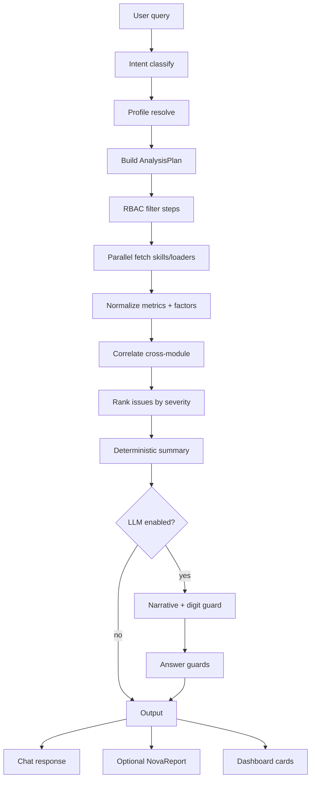
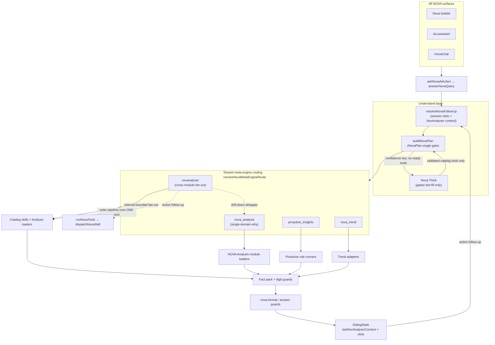

# NovANALYSER Engine Plan

**Status:** P0 built locally (feature-flagged) — not deployed to production  
**Date:** 2026-07-26  
**Workspace:** empower-erp  
**Author:** Architecture research (NOVA / ERP codebase audit)

---

## Deployment scope: entire NOVA AI (bubble, ERP web, NOVA Chat, BPG + SaaS); not Chat-exclusive

NovANALYSER is a **global NOVA AI capability**, not a NOVA Chat–only feature. After local validation it ships with **all NOVA surfaces and both planes** (BPG + SaaS).

| Surface | Entry path | NovANALYSER routing |
|---------|------------|---------------------|
| **ERP floating bubble** | `AppShell` → `NovaAiBubble` → `NovaAiChat` → `askNovaAiAction` | Shared `selectNovaTools` → `novanalyser` |
| **ERP `/ai-assistant`** | `NovaAiChat` → `askNovaAiAction` | Same |
| **NOVA Chat `/nova/chat`** | `NovaChatClient` → `NovaAiChat` → `askNovaAiAction` | Same |
| **Android shells (BPG + SaaS)** | WebView → any of the above routes | Same server-side stack |
| **Future client API** | `POST /api/client/v1/nova/ask` → `answerNovaQuery` | Same (when wired on branch) |

**Feature flag:** `NOVA_NOVANALYSER_ENABLED=1` gates **global** nova-tools routing (`isNovAnalyserCue` in `src/lib/ai/nova-tools.ts`) and the skill handler (`runNovAnalyserSkill`). It is **not** scoped to `/nova`, chat UI, or Android-only code paths.

**Planes:** Single implementation under `src/lib/novanalyser/` and `src/lib/ai/nova-tools.ts`. BPG (main) and SaaS (`feature/saas-tenancy-p0` when forked) share the same orchestrator; tenant isolation follows existing NOVA session + RBAC — no separate NovANALYSER fork per plane.

**NOVA Chat relationship:** NOVA Chat is **one client** of the same intelligence pipeline. P2 “Insights digest messages” in the Chat plan consume NovANALYSER **output**, but broad intents (“how can I improve the business?”, “can I increase my productivity?”) work from bubble and `/ai-assistant` today with the flag on.

---

## 1. Executive summary

**NovANALYSER** is the next evolution of emPOWER’s read-only intelligence stack: a **cross-module analytics engine** that answers broad, outcome-oriented questions (“How can I improve the business?”, “Can I increase my productivity?”) by **orchestrating existing NOVA skills**, **correlating certified metrics**, and **ranking issues with evidence** — never by letting an LLM query the database directly.

Today, NOVA is excellent at **catalog Q&A**: one utterance → one or a few bounded skills → facts → optional narration. A sibling engine, **NOVA Analysis** (`nova_analysis`), already explains *why* a single domain looks the way it does (KPI scorecard, overdue tasks, AR outstanding, attendance late, project health) via factor bundles and digit-guarded LLM polish. **Proactive insights** adds deterministic org-wide alert cards. **Packs** (`month_performance`, `daily_brief`) fan out multiple skills into a `NovaPackResult`.

**NovANALYSER differentiates** by:

| Dimension | Current NOVA Q&A | NOVA Analysis (live) | NovANALYSER (target) |
|-----------|------------------|----------------------|----------------------|
| Scope | Single module / metric | Single domain “why” | **Multi-module business health** |
| Intent | “Show overdue invoices” | “Why is outstanding high?” | “How can I improve business?” |
| Data path | 1–3 catalog tools | 1 module loader → factors | **Orchestrated fan-out + correlation** |
| Audience | Same RBAC as tools | Domain-scoped | **Role-aware analysis profiles** |
| Output | Chat answer | Chat + findings | Chat + **ranked issues** + saved report + dashboard cards |
| Proactivity | On-demand | On-demand | On-demand + **scheduled / pulse alerts (P2)** |

**Recommendation:** Implement NovANALYSER as a **new orchestration layer inside the NOVA stack** (not a separate microservice in P0), exposed as catalog tool `novanalyser` / skill `ops.novanalyser`, reusing `NovaAnalysisBundle`, `NovaFinding`, `NovaPackResult`, and immutable `NovaReport` snapshots. Preserve the commercial-ready hybrid: **rules-first intent → RBAC-filtered metric plan → Prisma via skills → deterministic correlation → optional LLM narrative with guards**.

---

## 2. Current state audit

### 2.1 NOVA skills inventory

**Location:** `src/lib/nova/skills/registry.ts` (~80+ catalog tools)

| Domain | Representative tools | Analysis module status |
|--------|---------------------|------------------------|
| **HR** | `attendance_late_summary`, `leave_summary`, `overtime_summary`, `regularisation_summary`, `salary_summary`, `staff_advances_summary`, `staff_summary` | Attendance **shipped**; leave/salary **P1/P2** |
| **Ops** | `tasks_summary`, `projects_summary`, `delivery_summary`, `stock_summary`, `grn_summary`, `incentives_summary`, `kpi_summary`, `kpi_report`, `approvals_summary` | Tasks, project **shipped**; delivery, stock, approvals **P1** |
| **Finance** | `sales_summary`, `receipts_summary`, `receivables_summary`, `overdue_invoices`, `customer_outstanding`, `bank_recon_summary`, `purchase_*`, `gstr_snapshot`, `profitability_summary`, `director_dashboard_summary` | Outstanding **shipped**; sales, collection, bank, GST **P1/P2** |
| **Meta engines** | `nova_analysis`, `nova_trend`, `proactive_insights`, `daily_brief`, `month_performance` | Partial cross-module patterns exist |
| **Entity 360** | `entity_360` (payment request only) | Per-record cross-module — extension point |

**Key files:**

- Skills: `src/lib/nova/skills/`
- Analysis engine: `src/lib/nova/analysis/` (engine, loaders, adapters, registry)
- Trend: `src/lib/nova/trend/`
- Packs: `src/lib/nova/packs/`
- Metrics dictionary: `src/lib/nova/semantic/metrics.ts`
- Module coverage prep: `src/lib/nova/module-coverage-prep.ts`

### 2.2 Existing analysis engine (foundation)

**Shipped P0 modules** (`src/lib/nova/analysis/modules/registry.ts`):

1. `kpi` — scorecard SoT via `loadKpiScorecard`
2. `tasks` — overdue / completion drivers
3. `outstanding` — AR aging, overdue invoices, receipts gap
4. `attendance` — late / absent patterns
5. `project` — delay + task spine via `project_command` dashboard

**Pipeline today:**

```
User cue → inferNovaAnalysisDomain (rules)
        → module loader (RBAC + Prisma/skills)
        → NovaAnalysisBundle (factors + evidence)
        → runNovaAnalysis (rank → deterministic narrative → optional LLM)
        → NovaFinding[] + chat fact
```

**Guards already in place:**

- Digit guard (`novaAnalysisNarrativeDigitGuard`) — LLM cannot invent numbers
- Factor-id guard — LLM must cite supplied drivers
- RBAC in loaders before bundle construction
- Deterministic fallback always available

### 2.3 Data APIs & Prisma models

Skills use **`prisma` read-only** (`src/lib/nova/prisma-readonly`) with existing domain helpers:

- KPI: `KpiReview`, `KpiPeriod`, `loadKpiScorecard`, `kpiTeamUserIdsForUser`
- Projects: `Project`, `ProjectStatusDate`, `ProjectChecklistItem`
- Sales/AR: `SalesInvoice`, `getReceivablesAgingBuckets` (`src/lib/reports/queries.ts`)
- Delivery: `DeliveryChallan`, `DeliveryRecord`, `DeliveryStageDate`
- HR: `HrAttendanceDaily`, `HrAttendancePunch`, leave/OT/regularisation models
- Reports plane: `NovaReport` (immutable snapshot JSON + security envelope)

**No raw SQL from LLM.** All access is typed Prisma in skill handlers or shared lib queries — NovANALYSER must continue this pattern.

### 2.4 RBAC & tenant isolation

**Permission source of truth:** `src/lib/rbac.ts` + `src/lib/ai/nova-tool-permissions.ts`

- Role matrix: `SUPER_ADMIN` / `ADMIN` → ALL; `MANAGER`, `ACCOUNTANT`, `DIRECTOR`, `STAFF` → scoped sets
- Tool floor: `NOVA_TOOL_PERMISSIONS[toolId]` (any-of)
- Extra gates: `novaCanRunTool()` — org finance (`canViewOrgFinanceAggregates`), salary visibility, backup/admin tools
- Analysis floor: `nova_analysis` requires `ai.assistant.read` **plus** at least one domain read (kpi/task/invoice/attendance/project)
- Tenant: `NovaReport.tenantId` (default `"default"`); envelope + object keys; SaaS prep in schema

**Staff money-hide:** `invoice.read` alone does **not** grant org totals — need `accounts.reports.read` / `finance.dashboard.read` / etc.

### 2.5 Report & snapshot patterns

**Immutable reports** (`src/lib/nova/reports/snapshot.ts`):

- `buildImmutableNovaReportSnapshot` → checksum, `permissionsUsed`, `dataAsOf`, `expiresAt`
- UI: `src/components/nova-my-reports.tsx` — list, regenerate, download txt/csv/pdf
- Packs produce `NovaPackResult` with metrics, charts, attentions, findings

**Existing cross-module pack precedents:**

- `daily_brief` — role-based tool fan-out (`DAILY_BRIEF_PACKS`)
- `month_performance` — director month with ≤3 attentions, chart bindings
- `proactive_insights` — parallel rule runners → insight cards

### 2.6 LLM integration

**Location:** `src/lib/ai/llm.ts`

- Default: Groq `llama-3.3-70b-versatile` with failover chain (Gemini, OpenRouter, etc.)
- NOVA Think: gated slot fill when search confidence low — **never free tool pick**
- Analysis narration: bounded JSON payload, digit guard, rate-limit soft-fail
- Context: fact packs only — chat memory is T0–T2, not ledger authority (`NOVA_FINAL_ARCHITECTURE.md`)

### 2.7 Gaps vs full cross-module analysis

| Gap | Impact |
|-----|--------|
| Single-domain analysis routing | “Improve business” has no orchestrator |
| 12+ planned analysis modules unwired | Delivery, leave, sales, stock invisible to analysis |
| No cross-domain correlation | Cannot link “late delivery → overdue AR → project delay” |
| No issue ranking across modules | Proactive insights lists cards but doesn’t synthesize |
| No staff “productivity profile” composite | My-work + KPI + attendance not merged |
| Entity 360 limited to payment requests | No project/customer 360 for analysis |
| No analysis-specific caching | Repeated fan-out hits DB |
| No analysis audit trail beyond report envelope | Compliance / “who saw what” incomplete |
| Broad intent cues absent from lexicon | “Improve business” routes to unclear / help |

---

## 3. Architecture decision

### 3.1 Options considered

| Option | Pros | Cons | Verdict |
|--------|------|------|---------|
| **A. Extend `nova_analysis` skill** | Reuses registry, shippable fast | Name collision; single-domain cues already crowded | Partial — keep for domain “why” |
| **B. New skill layer + orchestrator (`novanalyser`)** | Clear product boundary; composes Analysis + Packs + Insights | More routing/plan code | **Recommended P0** |
| **C. Separate service / worker** | Scale isolation, async jobs | Ops cost, duplicates RBAC, breaks tip deploy rhythm | **P2+** for scheduled/proactive only |
| **D. Free-form agent with SQL** | Flexible | Violates commercial-ready architecture; hallucination / leak risk | **Rejected** |

### 3.2 Target architecture

```
┌─────────────────────────────────────────────────────────────────┐
│  UI: Nova bubble · /ai-assistant · NOVA Chat · Android shells   │
└────────────────────────────┬────────────────────────────────────┘
                             │
┌────────────────────────────▼────────────────────────────────────┐
│  NOVA Understand / Plan (existing)                                 │
│  + NovAnalyserIntentClassifier (rules + gated Think)             │
│  + NovAnalyserProfileResolver (admin | manager | staff | …)      │
└────────────────────────────┬────────────────────────────────────┘
                             │
┌────────────────────────────▼────────────────────────────────────┐
│  NovANALYSER Orchestrator (NEW)                                    │
│  1. Build AnalysisPlan from profile + intent + RBAC              │
│  2. Fan-out catalog skills / analysis loaders (bounded concurrency)│
│  3. Normalize → NovAnalyserMetricSnapshot[]                      │
│  4. Correlate + rank → NovAnalyserIssue[]                        │
│  5. Compose NovAnalyserResult (findings + evidence + links)        │
└─────┬──────────────────┬──────────────────┬───────────────────────┘
      │                  │                  │
      ▼                  ▼                  ▼
┌───────────┐   ┌────────────────┐   ┌──────────────────┐
│ NOVA      │   │ NOVA Analysis  │   │ Proactive rules  │
│ Skills    │   │ module loaders │   │ + Trend adapters │
│ (facts)   │   │ (factor bundles)│   │ (time context)   │
└───────────┘   └────────────────┘   └──────────────────┘
      │                  │                  │
      └──────────────────┴──────────────────┘
                         │
              Prisma (read-only) + domain libs
                         │
              NovaReport snapshot (optional persist)
```

**Naming:**

- Engine code: `src/lib/novanalyser/` (or `src/lib/nova/analyser/` to nest under NOVA)
- Catalog tool: `novanalyser` (distinct from `nova_analysis`)
- Skill id: `ops.novanalyser`

**Relationship to `nova_analysis`:**

- **`nova_analysis`** remains the **single-domain “why”** engine (fast path, existing cues).
- **`novanalyser`** handles **broad / multi-module** intents and **profile-scoped composites**.
- Domain-specific “why” can be **delegated** to `nova_analysis` loaders when the plan selects one module.

---

## 4. Data access layer

### 4.1 Module registry (extended)

Extend `NOVA_MODULE_COVERAGE_MATRIX` (`module-coverage-prep.ts`) into **`NovAnalyserModuleRegistry`**:

```typescript
type NovAnalyserModuleEntry = {
  moduleId: string;           // e.g. "finance.ar_sales"
  label: string;
  toolIds: string[];          // catalog skills to invoke
  analysisModuleId?: string;  // link to NOVA Analysis loader if exists
  metricIds: string[];        // subset of NOVA_METRICS
  profiles: ("director" | "manager" | "accountant" | "staff")[];
  rbacFloor: Permission[];    // any-of + extra gates documented
  dataClasses: NovaSkillDataClass[];
  fanoutPriority: number;     // lower = fetch earlier
  correlationTags: string[];  // e.g. ["cash", "delivery", "people"]
};
```

**Rules:**

1. **No ad-hoc SQL** in orchestrator — only `dispatchNovaSkill` / registered loaders / certified lib queries (`getReceivablesAgingBuckets`, `loadKpiScorecard`, etc.).
2. **Metric catalog** extends `NOVA_METRICS` with NovAnalyser-specific composites (e.g. `productivity.attendance_score`, `business.health_index`) — all marked `deterministicRequired: true` with explicit `sourceOfTruth`.
3. **Safe query patterns:** reuse skill `where` builders (team scope, self scope, `novaOpenApprovalsWhere`, `kpiTeamUserIdsForUser`); never accept user strings as Prisma fragments.
4. **Empty semantics:** propagate `emptyMeaning` from metric defs — never treat fetch failure as zero.

### 4.2 Analysis plan builder

Input: `{ user, query, profile, intent, period?, entityHints? }`

Output: **`NovAnalyserPlan`**

```typescript
type NovAnalyserPlan = {
  planId: string;                    // e.g. "business_health_v1"
  profile: NovAnalyserProfile;
  steps: NovAnalyserPlanStep[];      // max N steps (default 12 P0, 20 P1)
  permissionsRequired: Permission[];
  skippedModules: { moduleId; reason: "rbac" | "disabled" }[];
  periodLabel: string;
};
```

Plan templates (initial):

| Template ID | Trigger cues | Modules (RBAC-filtered) |
|-------------|--------------|-------------------------|
| `business_health` | improve business, business health, what's wrong | sales, receipts, AR, projects, delivery, approvals, stock, KPI org |
| `productivity_self` | my productivity, how am I doing, improve performance | my_work, kpi self, attendance self, leave self, tasks self |
| `productivity_team` | team productivity | attendance team, kpi team, tasks team, leave queue |
| `delivery_risk` | delivery risk, late deliveries | delivery, projects, stock, tasks |
| `cash_flow` | cash flow, collections, liquidity | receipts, AR, bank, payment requests |
| `kpi_trends` | kpi trends, performance trends | kpi + nova_trend adapters |

### 4.3 Normalization layer

Each skill fact → **`NovAnalyserMetricSnapshot`**:

- `metricId`, `value`, `unit`, `period`, `toolId`, `provenance`, `severityHint?`, `entityScope`
- Analysis bundles → additional **`NovAnalyserFactorSnapshot`** (flatten top-N factors)

Enables deterministic correlation without LLM.

---

## 5. RBAC matrix — what each role can analyse

Legend: **Y** = included when permitted; **S** = self/team scope only; **—** = never shown; **$** = requires `canViewOrgFinanceAggregates`

| Analysis domain | SUPER_ADMIN / ADMIN | DIRECTOR | MANAGER | ACCOUNTANT | STAFF |
|-----------------|---------------------|----------|---------|------------|-------|
| **Business health (org)** | Y | Y ($) | Partial (no $ totals) | Y ($) | — |
| **Sales & billing** | Y ($) | Y ($) | Summary only | Y ($) | — |
| **Collections / AR** | Y ($) | Y ($) | — | Y ($) | — |
| **Cash & bank** | Y | Y | — | Y | — |
| **Projects & delivery** | Y | Y | Y | — | S (assigned) |
| **Stock / procurement** | Y | Y | Y | Partial | — |
| **Approvals bottlenecks** | Y | Y | Y (team) | Y | S (self) |
| **KPI org / team** | Y | Y | Y (team) | — | S (self) |
| **Attendance / leave** | Y | Y | Y (team) | — | S (self) |
| **Salary / payroll** | Y | Y | — | Partial | S (payslip.self) |
| **Staff advances** | Y | Y | — | Y | S (self) |
| **GST / compliance** | Y | Y | — | Y | — |
| **System (backup/tally)** | Y | Y | — | — | — |
| **Productivity composite** | Y | Y | Y (team) | — | S (self) |

**Enforcement layers (defense in depth):**

1. `novanalyser` tool floor: `ai.assistant.read` + profile-specific domain reads (stricter than `nova_analysis`)
2. Plan builder drops steps user cannot run (`filterNovaToolsForUser` + module floors)
3. Skill handlers re-check `can(...)` (unchanged)
4. Result envelope records `permissionsUsed` + `skippedModules` with `permission_omission` warnings in pack
5. Money fields stripped at presentation when `!canViewOrgFinanceAggregates`
6. HR PII: staff cannot analyse peers’ attendance/KPI unless `*.team` permission

**Tenant isolation:** all snapshots include `tenantId`; orchestrator reads session company context; future SaaS multi-tenant uses same envelope pattern as `NovaReport`.

---

## 6. Analysis pipeline

### 6.1 End-to-end flow



### 6.2 Intent classification

**Rules-first** (extend `nova-lexicon` + new `isNovAnalyserCue()`):

| Intent | Example cues |
|--------|--------------|
| `business_health` | improve business, how is business, what's hurting, core issues |
| `productivity_self` | my productivity, how can I improve, am I performing |
| `productivity_team` | team performance, who is struggling |
| `delivery_risk` | delivery risk, late deliveries impact |
| `cash_flow` | cash flow, liquidity, collections problem |
| `kpi_trends` | kpi trend, performance over time |
| `domain_delegation` | falls through to existing `nova_analysis` cues |

**Gated Think:** only when rules return `confidence: low` — output must be JSON `{ intent, profile?, period? }` validated against enum (no free tool list).

### 6.3 Correlation engine (deterministic)

**Correlation rules v1** (examples):

| Rule ID | Condition | Elevated issue |
|---------|-----------|----------------|
| `C01` | overdue AR ↑ + receipts ↓ same period | Collections gap |
| `C02` | project past ECD + delivery delays | Delivery / project slip |
| `C03` | low KPI attendance parameter + late count ↑ | Attendance drag on KPI |
| `C04` | approval queue aged + payment requests pending | Workflow bottleneck |
| `C05` | stock below min + project active + delivery delayed | Supply risk |
| `C06` | staff late ↑ + task overdue ↑ (same person) | Personal productivity |
| `C07` | GST e-invoice failures + overdue billing | Compliance + cash |

Each rule emits **`NovAnalyserIssue`**:

```typescript
type NovAnalyserIssue = {
  id: string;
  title: string;
  severity: "critical" | "high" | "medium" | "low";
  score: number;              // deterministic ranking
  observation: string;        // template-filled from metrics
  evidence: NovaFinding["evidence"];
  contributors: { toolId; metricId?; moduleId }[];
  recommendations: { label; href }[];
  correlationRuleId?: string;
  confidence: "fact" | "supported_inference";
};
```

**Ranking formula (v1):**

```
score = severityWeight * 100
      + log1p(financialExposureInr) * w_money   // 0 if money-hidden
      + log1p(countImpact) * w_count
      + recencyBoost
      + correlationBoost
```

### 6.4 Narrative + evidence

- **Headline:** top issue title or profile-specific summary (“3 areas need attention”)
- **Body:** deterministic template listing top 5 issues with evidence bullets
- **LLM polish (optional):** synthesize narrative **only from** `NovAnalyserIssue[]` + metric snapshots; same digit guard as Analysis
- **Findings:** `formatNovaFindings(issues.map(i => i.finding))`
- **Links:** deep links from contributors (existing module hrefs)

---

## 7. Example analyses

### 7.1 Business health (Admin / Director)

**Query:** “How can I improve the business?”

**Plan:** `business_health` → sales, receipts, overdue, projects, delivery, approvals, stock, director dashboard, KPI org (if permitted)

**Sample output issues:**

1. **Critical — Collections gap:** ₹42L overdue (+18% vs last month); receipts down 12% — evidence: `overdue_invoices`, `receipts_summary`
2. **High — Project delays:** 4 active projects past ECD — evidence: `projects_summary`, `proactive_insights/project_delays`
3. **High — Approval bottlenecks:** 7 approvals idle ≥3 days — evidence: `approvals_summary`
4. **Medium — Low stock:** 12 SKUs at/below minimum — evidence: `stock_summary`
5. **Medium — KPI attendance drag:** Org attendance parameter averaging 62 — evidence: `kpi_summary` + attendance module

### 7.2 Productivity (Staff)

**Query:** “Can I increase my productivity?”

**Plan:** `productivity_self` → `my_work_summary`, KPI self analysis loader, attendance self, leave balance, tasks self

**Sample output:**

1. **High — Task overdue concentration:** 8 of 12 open tasks overdue >7 days
2. **Medium — KPI gap:** Sales calls parameter at 45% of target (report card factor)
3. **Medium — Late arrivals:** 6 late days this month vs 2 last month
4. **Low — Leave pipeline:** 2 pending leave requests (informational)

**Explicit omission:** no peer comparisons, no org sales totals.

### 7.3 Delivery risk (Manager)

**Query:** “What’s our delivery risk this month?”

**Issues:** delayed challans, projects with checklist gaps, stock shortages for open orders, tasks blocking dispatch.

### 7.4 Cash flow (Accountant / Director)

**Query:** “How is cash flow?”

**Issues:** receipts vs sales gap, AR aging shift, unreconciled bank lines, large pending payment requests.

### 7.5 KPI trends (Manager)

**Query:** “Are KPIs improving?”

**Delegate:** fan-out `kpi_summary` + `nova_trend` for team scope; highlight declining parameters vs prior period.

---

## 8. LLM vs rules vs hybrid

| Stage | Mechanism | Rationale |
|-------|-----------|-----------|
| Intent / profile | **Rules** (+ gated Think) | Must not invent modules or bypass RBAC |
| Plan selection | **Rules** (template registry) | Bounded fan-out; testable |
| Data fetch | **Deterministic** (skills/Prisma) | Source of truth |
| Metric normalization | **Rules** | Typed mapping from fact shapes |
| Cross-module correlation | **Rules** (v1) | Explainable; auditable |
| Issue ranking | **Rules** | Stable ordering; eval goldens |
| Issue titles / one-liners | **Templates** | No LLM required |
| Executive narrative | **Hybrid** — LLM optional | Readability; guarded |
| Recommendations | **Rules** — link to ERP routes | LLM must not invent URLs |
| Predictions | **Avoid in P0** | If added later: label `confidence: inference` per Finding contract |

**Environment flags:**

- `NOVA_NOVANALYSER_LLM=0` — facts-only mode
- Reuse existing `NOVA_ANALYSIS_LLM=0` behaviour for delegated domain analysis

---

## 9. Output formats

| Format | Mechanism | P phase |
|--------|-----------|---------|
| **Chat response** | `NovaAnswer` via existing format pipeline (`nova-format.ts`) | P0 |
| **Structured fact** | `tool: novanalyser`, `issues[]`, `findingsFormatted`, `planId` | P0 |
| **Saved report** | `NovAnalyserPack` → `buildImmutableNovaReportSnapshot` → `NovaReport` | P1 |
| **Dashboard cards** | Reuse proactive insight card component; feed ranked top-3 issues | P1 |
| **PDF** | Extend report plane PDF renderer for `packId: novanalyser_business_health` | P1 |
| **CSV export** | Issue table + metric appendix from frozen pack | P2 |
| **Nova bubble chips** | “Business health”, “My productivity” suggest chips when RBAC allows | P0 |
| **Standalone app (future)** | `/analyser` or desktop — same API `askNovaAiAction` + dedicated layout | P2+ |

**Pack schema (proposed):**

```typescript
type NovAnalyserPackId =
  | "novanalyser_business_health"
  | "novanalyser_productivity"
  | "novanalyser_delivery_risk"
  | "novanalyser_cash_flow";
```

---

## 10. Integration points

### 10.1 All NOVA surfaces (not Chat-exclusive)

NovANALYSER routes through the **shared** `askNovaAiAction` → `answerNovaQuery` → `selectNovaTools` pipeline. Every client below gets identical tool routing when `NOVA_NOVANALYSER_ENABLED=1`:

- **ERP floating bubble** (`NovaAiBubble` in app shell)
- **`/ai-assistant`** full-page chat
- **NOVA Chat** (`/nova/chat` — same `NovaAiChat` component)
- **Capacitor Android shells** (BPG + SaaS WebView to the same routes)

Integration checklist (P0 done locally):

- [x] Lexicon topic `novanalyser` with cues (`src/lib/ai/nova-lexicon.ts`)
- [x] Route broad cues to `novanalyser` **before** `nova_analysis` (`selectNovaTools`)
- [x] Skill `ops.novanalyser` registered (`src/lib/nova/skills/registry.ts`)
- [x] Global feature flag `NOVA_NOVANALYSER_ENABLED` (routing + handler)
- [ ] Profile-aware suggest chips in `novaSuggestedPrompts` (P0 polish)
- [ ] Daily brief embeds top NovAnalyser issue as optional attention (P1)

### 10.2 Existing engines

| Engine | Integration |
|--------|-------------|
| `nova_analysis` | Delegated for single-domain deep dives |
| `nova_trend` | Time context for trend intents |
| `proactive_insights` | Share correlation rules; NovAnalyser superset for on-demand |
| `month_performance` | Director pack can call NovAnalyser for attention selection |
| `entity_360` | Future: entity-scoped analysis plans |

### 10.3 Coherence with NOVA engines

NovANALYSER is **not** a parallel chat path. It composes with the same orchestration stack as NovaPlan, Nova Think, NOVA Analysis, packs, and proactive insights.

#### Composition diagram



#### Routing order (meta engines)

Shared by **`selectNovaTools`** and **`buildNovaPlan`** via `src/lib/ai/nova-engine-routing.ts`:

| Priority | Cue family | Tool | Notes |
|----------|------------|------|-------|
| 1 | Entity 360 record code | `entity_360` | Before recipes / meta engines |
| 2 | Bounded recipes | `project_command`, … | Thin depth may override |
| 3 | **NovANALYSER broad intents** | `novanalyser` | `NOVA_NOVANALYSER_ENABLED=1`; before Analysis |
| 4 | Domain “why” / analysis depth | `nova_analysis` | Single-module factor bundles |
| 5 | Trend / frequency | `nova_trend` | After Analysis so “why late” stays Analysis |
| 6 | Proactive queue | `proactive_insights` | Deterministic alert cards |
| 7 | Compose + lexicon | module skills | KPI, sales, tasks, … |

**NovANALYSER vs NovaPlan:** `buildNovaPlan` resolves meta engines **before** `composeNovaIntent`, so broad asks get `confidence: high` and **do not** fall through to Nova Think free tool pick. The outer pipeline runs exactly **`novanalyser`** once; internal fan-out is bounded inside `runNovAnalyser()` — no double-fetch at the plan layer.

**NovANALYSER vs NOVA Analysis:** `classifyNovAnalyserIntent` returns `unknown` when `isNovaAnalysisCue` matches — domain “why outstanding / why kpi” stays on `nova_analysis`. NovANALYSER may **delegate** follow-ups to `nova_analysis` for drill-down (`src/lib/novanalyser/follow-up.ts`).

#### Session facts & follow-ups

After a successful NovANALYSER answer, ranked issues are stored in **`DialogState.lastNovAnalyserContext`** (TTL aligned with conversation slots). Follow-up phrases (“what should I do”, “suggest actions”, “tell me more about …”) merge a **NovaPlan** with:

- **Action follow-up** → top issue’s contributor summary skill (e.g. `overdue_invoices`) — **not** a full NovANALYSER re-run
- **Drill-down follow-up** → `nova_analysis` with a domain cue derived from contributors

This feeds NovaPlan the same way period/entity slot merges do — `forcedTools` from the merged plan, preserving digit guards and narration patterns from the target engine.

#### Nova Think / LLM

- **Think** runs only when NovaPlan has **no ready tools** and low confidence — meta-engine plans skip Think entirely.
- NovANALYSER P0 narrative is **deterministic**; optional LLM polish (P0+) reuses Analysis digit guards (`novaAnalysisNarrativeDigitGuard` pattern).
- Think and LLM planner **never** emit `novanalyser` unless it appears in the RBAC-filtered catalog allow-list — same as all tools.

#### Packs & proactive

| Engine | Relationship to NovANALYSER |
|--------|----------------------------|
| `daily_brief` | Shares `mapWithConcurrency` fan-out pattern; P1 may embed top NovAnalyser issue as attention |
| `month_performance` | Director pack may call NovAnalyser for attention selection (P1) |
| `proactive_insights` | Overlapping correlation themes; NovAnalyser is on-demand superset with ranked synthesis |
| `nova_trend` | Separate meta route; `kpi_trends` template delegates trend adapters (P1) |

#### Key files (coherence)

| Role | Path |
|------|------|
| Shared meta routing | `src/lib/ai/nova-engine-routing.ts` |
| NovaPlan gate | `src/lib/ai/nova-plan.ts` |
| Tool selection | `src/lib/ai/nova-tools.ts` |
| Query pipeline | `src/lib/ai/nova.ts` |
| Follow-up merge | `src/lib/ai/nova-context.ts` |
| Session facts | `src/lib/nova/dialog-state.ts` |
| NovANALYSER follow-up delegate | `src/lib/novanalyser/follow-up.ts` |
| Coherence tests | `src/lib/novanalyser/nova-engine-coherence.test.ts` |

### 10.4 Standalone app (future)

- Read-only API: `POST /api/client/v1/nova/analyser` (mirror ask route)
- Same session + RBAC + quota (`nova-company-quota`)
- Mobile shell (Capacitor) → WebView to analyser route

---

## 11. Phased rollout

### Phase P0 — Foundation (4–6 weeks)

**Goal:** Shippable `novanalyser` for 2 templates with chat output.

- [ ] Create `src/lib/novanalyser/` (or `nova/analyser/`) — orchestrator, plan registry, normalizer
- [ ] Catalog tool + skill registration
- [ ] Intent classifier + lexicon topic
- [ ] Templates: `business_health` (director/admin/accountant), `productivity_self` (staff/manager self)
- [ ] Wire 8–10 existing skills per template with RBAC filtering
- [ ] Deterministic correlation rules C01–C04
- [ ] Issue ranking + deterministic narrative
- [ ] Optional LLM narrative with digit guard
- [ ] Unit tests + QI goldens (`novanalyser-business-health`, `novanalyser-productivity-self`)
- [ ] Feature flag: `NOVA_NOVANALYSER_ENABLED=1`

**Metrics:** plan latency p95 <8s (8 parallel skills), zero money leak on Staff in CI.

### Phase P1 — Cross-module depth (6–8 weeks)

- [ ] Ship remaining NOVA Analysis P1 modules (delivery, leave, sales, stock, approvals, bank, collection)
- [ ] Templates: `delivery_risk`, `cash_flow`, `productivity_team`
- [ ] Correlation rules C05–C10
- [ ] `NovAnalyserPack` + save to `NovaReport` + PDF
- [ ] Dashboard cards on director / manager home
- [ ] Analysis result caching (see §12)
- [ ] Audit log entries for saved reports

### Phase P2 — Proactive & scale (8+ weeks)

- [ ] Scheduled NovAnalyser runs (cron / Railway worker) → notification digest
- [ ] Nova Pulse integration — trigger re-analysis on significant events
- [ ] Entity 360 expansion (project, customer)
- [ ] Standalone analyser UI
- [ ] Optional separate worker service if fan-out exceeds API timeout
- [ ] Cross-tenant SaaS hardening

---

## 12. Performance, caching, audit trail

### 12.1 Performance

- **Bounded concurrency:** reuse `mapWithConcurrency` from `daily-brief` (default 4–6)
- **Plan step cap:** P0 max 10 skills; P1 max 16
- **Timeouts:** per-skill 5s; total orchestration 25s → partial result with `completeness` warning
- **Read-only Prisma:** continue `prisma-readonly` — no write lock contention
- **Pre-aggregates:** prefer existing summary skills over N+1 row queries

### 12.2 Caching

| Cache key | TTL | Invalidation |
|-----------|-----|--------------|
| `novanalyser:plan:{userId}:{template}:{period}` | 5 min | manual refresh |
| Skill-level caches (where skills already cache) | inherit | — |
| Saved `NovaReport` | immutable until expiry | regenerate = new id |

Use Redis / in-memory only if already in stack; else short-lived process cache P1.

### 12.3 Audit trail

- **Chat turns:** existing redacted history (T2)
- **Saved reports:** `NovaReport.envelope.permissionsUsed`, `checksum`, `ownerUserId`, `tenantId`
- **P1:** `AuditLog` entry `novanalyser.report.saved` with planId + issue count (no PII body)
- **Denied modules:** surface in result `skippedModules` for transparency

---

## 13. Risks, privacy, hallucination guards

| Risk | Mitigation |
|------|------------|
| **Hallucinated metrics** | Digit guard; deterministic fallback; LLM never sees raw DB |
| **RBAC leak** | Plan filter + handler defense + money-hide + envelope |
| **Cross-staff PII** | Team scope via existing helpers; Staff profile hard-limits plan |
| **Over-broad fan-out** | Template step caps; timeout partials |
| **Stale data** | `dataAsOf`, `freshness-trust` warnings on facts |
| **Prompt injection** | Query treated as intent hint only; no tool injection |
| **Correlation false positives** | `confidence: supported_inference` label; user-facing “may be related” |
| **Quota / LLM cost** | One LLM call per request max; rate-limit soft-fail |
| **SaaS tenant bleed** | tenantId on all snapshots; session-scoped prisma (future) |

**Privacy:** Staff productivity analysis never includes salary amounts unless `hr.payslip.self`; director salary analysis requires explicit permissions.

---

## 14. Effort estimate

| Phase | Scope | Engineering | QA / goldens |
|-------|-------|-------------|--------------|
| **P0** | 2 templates, chat, rules correlation, RBAC | **3–4 dev-weeks** | 1 dev-week |
| **P1** | +4 templates, P1 analysis modules, reports/PDF, cache | **5–6 dev-weeks** | 1.5 dev-weeks |
| **P2** | Proactive scheduler, pulse, standalone UI, entity 360 | **6–8 dev-weeks** | 2 dev-weeks |

**Total to production-grade cross-module:** ~**16–20 dev-weeks** (one senior + NOVA familiarity).

**Incremental ship path:** P0 can release after 4–6 weeks without blocking existing NOVA tips.

---

## 15. Open questions

1. **Product naming in UI:** “NovANALYSER” vs “Business Insights” vs extend “NOVA Analysis” branding?
2. **Director vs Admin plan difference:** Same template or director includes profitability / order book?
3. **Issue score weights:** Who calibrates severity weights per industry (BIOPOWER defaults)?
4. **Partial failure UX:** Show 3/10 modules failed vs silent omit?
5. **KPI period selection:** Always latest approved period or ask clarify?
6. **Cross-module LLM correlation:** Stay rules-only for v1 or allow gated LLM “relatedness” scoring in P2?
7. **Mobile offline:** Does NovAnalyser require live fan-out or cached last report?
8. **SaaS tenancy timeline:** Block P2 worker split until tenant prisma middleware ships?
9. **Quota model:** Count NovAnalyser as 1 ask or N (fan-out multiplier)?
10. **Integration with Swarm / external agents:** Read-only API export format?

---

## 16. Recommended file layout (implementation reference)

```
src/lib/novanalyser/
  index.ts
  intent.ts              # isNovAnalyserCue, classifyNovAnalyserIntent
  profile.ts             # resolveNovAnalyserProfile(user, query)
  plan-registry.ts       # template definitions
  orchestrator.ts        # main runNovAnalyser()
  normalize.ts           # fact → metric snapshots
  correlate.ts           # rules engine
  rank.ts                # issue scoring
  format.ts              # deterministic narrative
  narrate.ts             # LLM polish (wrap analysis narrate)
  pack.ts                # NovAnalyserPack builder
  types.ts
  novanalyser.test.ts

src/lib/nova/skills/ops/novanalyser.ts   # skill handler
src/lib/ai/nova-tool-permissions.ts      # + novanalyser floor
src/lib/ai/nova-lexicon.ts               # + topic
```

---

## 17. Success criteria

- [ ] Director ask “how can I improve business?” returns ≥3 ranked issues with evidence links in <10s p95
- [ ] Staff ask “increase my productivity?” returns self-scoped issues only — **CI proves no org money fields**
- [ ] All numbers in narrative trace to skill fact or factor evidence
- [ ] Saved report regenerates identically from snapshot checksum
- [ ] QI goldens ≥95% route accuracy for NovAnalyser cues
- [ ] No regression to existing `nova_analysis` single-domain cues

---

## Appendix A — Key codebase references

| Area | Path |
|------|------|
| NOVA architecture target | `src/lib/nova/NOVA_FINAL_ARCHITECTURE.md` |
| Analysis engine | `src/lib/nova/analysis/engine.ts` |
| Analysis module registry | `src/lib/nova/analysis/modules/registry.ts` |
| Analysis loaders | `src/lib/nova/analysis/loaders.ts` |
| Skill registry | `src/lib/nova/skills/registry.ts` |
| Tool permissions | `src/lib/ai/nova-tool-permissions.ts` |
| RBAC | `src/lib/rbac.ts` |
| Proactive insights | `src/lib/nova/skills/ops/proactive-insights.ts` |
| Daily brief packs | `src/lib/nova/skills/ops/daily-brief.ts` |
| Month performance pack | `src/lib/nova/packs/month-performance.ts` |
| Metrics catalog | `src/lib/nova/semantic/metrics.ts` |
| Module coverage | `src/lib/nova/module-coverage-prep.ts` |
| Report snapshots | `src/lib/nova/reports/snapshot.ts` |
| LLM client | `src/lib/ai/llm.ts` |
| NovaReport model | `prisma/schema.prisma` (`NovaReport`) |

---

*End of plan — P0 implemented locally behind `NOVA_NOVANALYSER_ENABLED`; production deploy pending local BPG + SaaS device test.*
