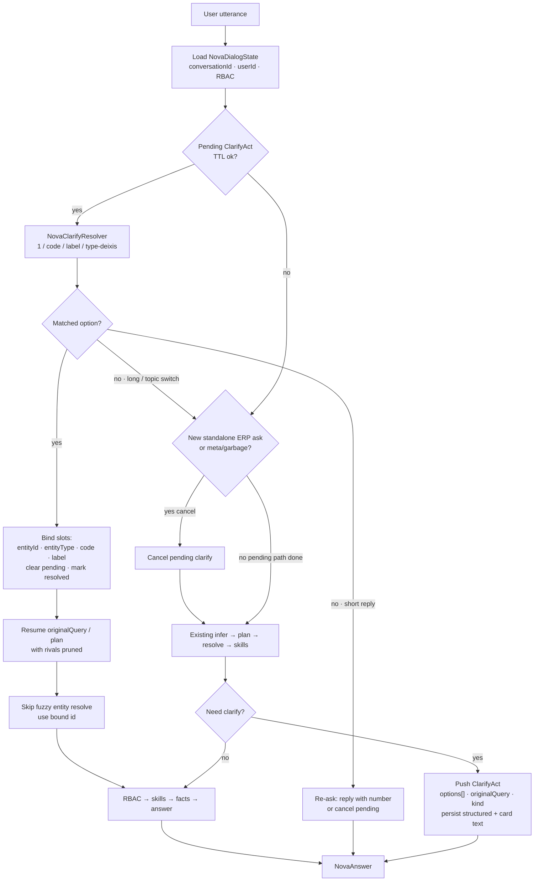

# NOVA dialog state — continued conversation / clarify follow-ups

**Status:** plan + P0/P1 largely landed on tip; **sticky bind after bare clarify** class fix in flight (`p2/nova-mm-approvals-docs`, see also `docs/NOVA_MULTI_MODULE_QUERY_PLAN.md` §0).  
**Live baseline:** **~3.0.71**  
**Bug (prod repro):** After an entity Did-you-mean card for bare `TATA STEELS`, reply `2` was treated as a project **search dump** instead of binding project into DialogState; module follow-ups (`pending tasks`, `this project`) lost clean sticky bind.

---

## 1. Research summary (enterprise patterns)

Serious copilots and task-oriented dialog systems treat numbered clarify as **dialog state**, not as free text that re-enters the same search.

### 1.1 Multi-turn disambiguation (numbered clarify → `1`)

| Pattern | What it does | Why it matters for NOVA |
|--------|----------------|-------------------------|
| **Pending clarification record** | Persist `{ originalQuestion, options[{id,label}], rivals }` with the assistant turn | Next turn resolves against options; never re-tokenizes bare `1` as a new entity search |
| **Resolution-before-retrieve** | Match reply → bind entity id/type → **re-run original intent** with rivals pruned | AWS semantic-layer agents hit an infinite clarify loop until they added exactly this ([clarification.py](https://github.com/aws-samples/sample-semantic-layer-structured/blob/main/agents/shared/clarification.py)) |
| **DST + slot fill** | Dialog State Tracking holds slots; clarify is a dialog act, not a new intent | Classic TOD / MultiWOZ family; DB search disambiguation papers treat “which result?” as its own turn type |
| **ECLAIR-style enterprise clarify** | Ambiguity agents → structured choices → user feedback resumes task | Adobe AEP assistant: clarify is grounded in catalog/entity linking, not chat prose |
| **Context-switch abandon** | If next utterance is a new full ERP ask, drop pending clarify | Avoid sticky wrong party when user pivots |

### 1.2 Short replies (`yes`, `2`, `that one`, `the project`)

Handle as **act resolvers** against the pending stack, in priority order:

1. Exact option index (`1`, `#2`, `option 3`)
2. Exact code / id (`C0014`, `C0014-P001`)
3. Exact label (case-insensitive)
4. Type deixis unique in options (`the customer`, `the project`, `staff`)
5. Soft deixis only if unique (`that one`, `yes` when single option — **never** when 2+)
6. Else: re-ask or “reply with a number” — do **not** re-run fuzzy party search on the short token

### 1.3 Session state vs long-term memory (tiers)

| Tier | Scope | Store | TTL | ERP-safe contents |
|------|--------|--------|-----|-------------------|
| **T0 Working / pending acts** | Current turn + next | Conversation row or Redis | Minutes–hours; clear on resolve/cancel | `ClarifyAct`, open slots, resume query |
| **T1 Session dialog state** | This chat thread | `NovaConversation` (+ structured JSON) | Session / 24h idle | Bound entity ids for thread, last plan slots (no ₹) |
| **T2 Turn history** | Recent messages | Existing `NovaMessage` (redacted) | Retention policy | Prose for UX; **not** sole source of truth for clarify |
| **T3 User preferences** | Cross-session | User settings / prefs table | Until user clears | Verbosity, default period grain, language — **never** party totals or “always Tata” |
| **T4 Org knowledge** | Shared | ERP DB via skills / aliases | Authoritative | Confirmed aliases, RBAC-gated reads |

**RAG-as-memory risks for ERP (do not do):**

- Embedding prior answers that contain ₹ / invoice lists → money bleed into new answers  
- “Remembering” a party across sessions without RBAC re-check → over-disclosure  
- Treating clarify option text as retrieval query → re-ambiguate the same name  
- Long-term “behavior” models that invent preferred metrics or silently pick entities  

### 1.4 Critique of proposed names

| Idea | Verdict |
|------|---------|
| **NovaReplySense** | Too broad; “continued conversation” sounds like transcript memory. **Do not ship this name** unless it is strictly the short-reply classifier sitting *under* dialog state. |
| **NovaMind** | Implies long-term behavioral memory. High privacy / wrong-sticky-entity risk. **Defer**; if ever needed, ship as **NovaUserPrefs** (explicit, editable, non-monetary). |

**Recommended names:**

| Engine | Role |
|--------|------|
| **NovaDialogState** | Session DST: pending act stack, bound slots, resume query, TTL, cancel on topic switch |
| **NovaClarifyResolver** | Pure functions: match `1` / label / code / type-deixis against `ClarifyAct.options` |
| **NovaUserPrefs** (P2) | Optional cross-session prefs only |

Keep existing: `inferNovaQuery`, `resolveNovaFollowUp`, `nova-clarify` cards — DialogState **owns** pending acts; FollowUp **consumes** resolved acts.

---

## 2. Current tip inspection

### 2.1 What already exists (good)

- Numbered clarify cards: `buildEntityClarifyCard` / `formatNovaClarifyCard` (`nova-clarify.ts`)
- Reply matching: `parseNovaClarifyOptionsFromAssistant`, `matchNovaClarifySelection`, `looksLikeNovaClarifyReply`
- Follow-up merge: `resolveNovaFollowUp` clarify branch binds entity/metric/period/staff (`nova-context.ts`)
- Inference: `clarify_option_pick` → `allowFollowUpMerge` (`nova-inference.ts`)
- Server memory: `NovaConversation` / `NovaMessage` + client `sessionStorage` (`memory.ts`, `nova-ai-chat.tsx`)
- Unit coverage for **metric-shaped** prior + `1` → sales (`nova.test.ts` “user replies 1 or exact label”)

### 2.2 Root cause of the `1` loop (code-level)

This is the same class of bug as AWS’s clarify infinite loop: **the answer to clarify is treated like a new ambiguous name search**, or the pending options are not reliably available as structured state.

#### A. Pending act is prose-only (no structured stack)

Clarify options live only in assistant **markdown**. Next turn re-parses history:

```390:417:src/lib/ai/nova-clarify.ts
export function parseNovaClarifyOptionsFromAssistant(text: string): NovaClarifyOption[] {
  const numbered: NovaClarifyOption[] = [];
  const lineRe =
    /^\s*(\d+)\.\s+\*\*([^*]+)\*\*(?:\s*\((customer|vendor|project|staff|metric|period|match)(?:\s*[·•]\s*([^)]+))?\))?/gim;
  // ...
}
```

Fragile: requires `**bold**`; type/code group needs middot/bullet. Hyphen form `(customer - C0014)` **drops code**; bare `1. Tata Steels (...)` **fails numbered parse**. Then `reply` becomes the **label** (`Tata Steels`).

#### B. Bind-by-label → re-enter `resolveNovaEntityHint` → same card

Entity pick sets `entity: picked.reply` (`code || label`), rebuilds a routing query, and tools **re-resolve** by string:

```307:335:src/lib/ai/nova-context.ts
      // Entity (customer / vendor / project / other)
      const entityName = picked.reply;
      let merged = mergeNovaPlanSlots(priorPlan, {
        entity: entityName,
        // ...
      });
```

```633:670:src/lib/ai/nova-tools.ts
  if (entityFilterName) {
    const resolvedEnt = await resolveNovaEntityHint(entityFilterName, user, { /* preferTypes */ });
    if (resolvedEnt.kind === "ambiguous") {
      // ... returns the same Did-you-mean card
```

For hint `"Tata Steels"`, Prisma `contains` hits **customer C0014** and **project “Tata Steels 800 Kg…”** → identical clarify. **That is the user-visible loop.**

Even when reply is `"C0014"`, projects use `projectId: { contains: hint }`, so C0014-P001 is in the candidate pool; exact code match usually saves customer-first, but the architecture is still “search again” instead of “bind id from act.”

#### C. Clarify digit detected but unmatched pick falls through

`looksLikeNovaClarifyReply("1", …)` returns true for any digit when the prior assistant *looks* like a clarify card, **without requiring a successful option parse**. If `matchNovaClarifySelection` returns null, the clarify `if (picked)` block does nothing and execution falls through — pending act is **not consumed**, and the turn continues as a weak follow-up / bare `"1"`.

#### D. Session history hole (amplifies miss)

```204:206:src/components/nova-ai-chat.tsx
    const prior = conversationId
      ? []
      : messages.map((m) => ({ role: m.role, content: m.text }));
```

```102:111:src/app/(app)/ai-assistant/actions.ts
  let safeHistory = clientHistory;
  if (conversationId) {
    const serverHistory = await loadNovaConversationHistory(...);
    if (serverHistory.length > 0) {
      safeHistory = serverHistory;
    }
    // else: empty client prior + empty server → no clarify context
  }
```

Once a `conversationId` exists, the client **omits** turns. If server memory is empty/failed/purged, `"1"` has **no** pending card. (Alone this often yields garbage/unclear — not the Tata card — but combined with label re-bind or client-only threads it explains flaky production.)

#### E. Wrong resume for bare party (related UX, not the loop)

Bare `"Tata Steels"` + pick `1` with no metric forces **silent `sales_summary`** in the entity branch. Product intent for “Tata Steels projects” should resume **projects for customer C0014** (or metric clarify), not invent month sales. Fix separately from the loop, but in the same DialogState “resume original query” design.

#### F. Why unit tests didn’t catch Tata

Happy-path test uses **two customers** + prior `"Acme sales this month"` + codes in bold markdown. It never covers:

- customer **vs project** sharing a name prefix  
- bare party / `… projects` resume  
- history empty under `conversationId`  
- bind-by-**id** skipping re-resolve  

---

## 3. Recommended architecture

### 3.1 Principle

**Pending `ClarifyAct` must win over re-running entity search on short replies.**  
Resolution binds **stable ids + types**; tools filter by id (or exact code), never by ambiguous display name after a clarify pick.

### 3.2 Flowchart



### 3.3 Data model (session)

```ts
type NovaClarifyAct = {
  id: string;                    // cuid
  kind: "entity" | "person" | "metric" | "period" | "generic";
  createdAt: string;             // ISO
  expiresAt: string;             // ISO — e.g. now + 30–120 min
  originalQuery: string;         // pre-clarify user text (normalized)
  hint?: string;                 // "Tata Steels"
  options: Array<{
    n: number;
    id: string;                  // DB id (customer/project/…)
    type: NovaClarifyOptionType;
    label: string;
    code?: string | null;
  }>;
  resume?: {
    tools?: string[];
    metric?: string | null;
    periodLabel?: string | null;
    module?: string | null;
  };
};

type NovaDialogState = {
  conversationId: string;
  userId: string;
  pendingClarify: NovaClarifyAct | null;  // stack depth 1 for P0; stack later
  bound?: {
    entityId?: string;
    entityType?: "customer" | "vendor" | "project";
    entityCode?: string;
    entityLabel?: string;
    personUserId?: string;
  };
  updatedAt: string;
};
```

**Storage options (pick one in P1):**

1. **Preferred:** column `NovaConversation.dialogState Json?` (RBAC-scoped by `userId`)  
2. Acceptable: first assistant message metadata / side table `NovaDialogAct`  
3. Avoid: only markdown history; avoid Redis-only if multi-instance without sticky sessions unless shared store

**Privacy / TTL / RBAC:**

- Store ids + labels already shown; no ₹, no invoice lists in dialog state  
- TTL 30–120 minutes idle; clear on resolve, cancel, logout, “new chat”  
- On resume, **re-check** `can(user, …)` for option type before running tools  
- Drop options the user can no longer see (same as `filterNovaClarifyChipsForUser`)  
- Retention: same or shorter than `NovaMessage`; never promote clarify picks into cross-session “NovaMind”

### 3.4 Integration points

| Stage | Change |
|-------|--------|
| Emit clarify | When building entity/person/metric cards, also `pushClarifyAct` |
| `askNovaAiAction` | Load dialog state with history; pass into `answerNovaQuery` |
| Before `infer` / `resolveNovaFollowUp` | If pending + short reply → **ClarifyResolver first** |
| After bind | Set plan `entity`/`entityId`/`entityType`; `forcedTools` from resume |
| `runNovaTools` | If `resolvedEntityDbId` already set from act, **do not** call fuzzy `resolveNovaEntityHint` |
| UI | Keep sending client history as fallback when server state empty; optionally send `clarifyActId` with chip clicks |

---

## 4. Ship breakdown

### P0 — Stop the `1` loop (small, high leverage)

**Goal:** `"1"` after entity Did-you-mean binds option 1 and does not re-clarify the same hint.

**Gate:** Plan doc first (this file). Implement P0 only as a focused follow-up PR off 2.136.3 — do not touch Ship A stash; do not bundle with unrelated NOVA skill work.

1. **Structured options on the wire for the next turn** (minimal):  
   - Persist clarify `options[]` (with **db id + type + code + label + n**) on the conversation or in a compact JSON blob when appending the clarify assistant turn.  
   - Or: extend `AskNovaResult` / message metadata so the next request carries `pendingClarify` (server-authoritative preferred).

2. **Resolver before follow-up:** If pending act exists and utterance matches index/code/label, bind **id+type**, clear pending, resume `originalQuery` with entity forced.

3. **Skip re-fuzzy:** In `runNovaTools`, honor pre-bound `entityId` / exact `entityCode` from dialog state / plan.

4. **History fallback:** If `conversationId` set but server history empty, **use client `history`**, do not silently answer with `[]`.

5. **Acceptance tests** (below) — especially Tata customer vs project.

*P0 can be a tiny patch without renaming engines; DialogState naming can arrive in P1.*

### P1 — NovaDialogState (session engine)

1. `NovaConversation.dialogState` (or act table) + load/save helpers  
2. Pending act stack (depth 1–2): entity → metric chain  
3. Topic-switch cancel (`isStandaloneNovaQuery` / meta / garbage)  
4. Resume plan: `"Tata Steels projects"` + pick customer → `projects_summary` filtered by **customer id**, not name contains  
5. Replace prose-parse as primary path; keep parse as legacy fallback  
6. Chip clicks submit `option.n` or `option.id` explicitly  

### P2 — NovaUserPrefs (not NovaMind)

1. Explicit prefs: answer length, default period when user always says “late” without day, locale  
2. User-visible clear/reset  
3. **No** auto sticky party, **no** money memory, **no** behavioral profiling  

---

## 5. What NOT to do

- Do **not** build **NovaMind** / long-term “user pattern” memory that silently picks entities or metrics  
- Do **not** RAG-retrieve prior assistant ₹ answers as context for new money questions  
- Do **not** treat bare `1`/`2` as entity search hints when any clarify is pending  
- Do **not** re-run `resolveNovaEntityHint` on the **display name** after a numbered pick  
- Do **not** force silent `sales_summary` on bare-party clarify resolution (ask metric or resume stated intent)  
- Do **not** drop client history when server memory is empty  
- Do **not** store raw salary / bank content in dialog state  
- Do **not** block Phase F–G on this plan; keep dialog work branch-isolated  

---

## 6. Acceptance tests (`"1"` after clarify)

Add goldens under Phase clarify / Phase 0 ambiguous_entity (Vitest + optional catalog id).

| # | Setup | User | Expect |
|---|--------|------|--------|
| T1 | Clarify: (1) Tata Steels customer C0014 (2) Tata Steels 800 Kg… project C0014-P001; prior `"Tata Steels projects"` | `1` | **No** second Did-you-mean; tools include `projects_summary` (or status/tasks as planned); filter **customer id** C0014; not project-only preferTypes steal |
| T2 | Same card | `2` | Bound to project C0014-P001; no re-clarify |
| T3 | Same card | `C0014` | Same as T1 |
| T4 | Same card | `the customer` | Same as T1 when unique type |
| T5 | Same card | `the project` | Same as T2 |
| T6 | Same card; `conversationId` set; **server history empty**; client still has clarify text | `1` | Uses client fallback or persisted act — **not** empty-history failure |
| T7 | Pending clarify | `leave balance` (standalone) | Cancel pending; answer leave — no entity clarify loop |
| T8 | Pending clarify | `9` (OOB) | Soft re-ask; do not fuzzy-search `"9"` |
| T9 | Pending clarify | `yes` with 2 options | Re-ask; do not silent-pick |
| T10 | Metric clarify after period | `2` / `receipts` | Existing behavior preserved |
| T11 | Bound customer then money ask in-thread | `sales this month` | Uses bound entity id; no re-clarify on name |
| T12 | RBAC: user loses `project.read` mid-pending | `2` on project option | Deny/re-filter; never leak project facts |

**Regression:** existing `user replies 1 or exact label → merges entity and runs tool` must keep passing.

---

## 7. Engine naming (final)

| Ship | Name |
|------|------|
| Session DST + pending acts | **NovaDialogState** |
| Short-reply matcher | **NovaClarifyResolver** (module under dialog state or `nova-clarify.ts`) |
| Optional prefs | **NovaUserPrefs** |
| Avoid | NovaReplySense, NovaMind |

---

## 8. Implementation sketch (for implementer — not this doc’s job)

1. P0 test first: mock customer + project both matching `"Tata Steels"`; history with formatted card; `answerNovaQuery(user, "1", hist)`.  
2. Persist act when returning entity clarify from `resolveNovaEntityHint` / `withClarifyOptionsFromFacts`.  
3. At top of `answerNovaQuery`, `resolvePendingClarify(raw, state)` → short-circuit merge.  
4. Thread `resolvedEntityDbId` / type into `runNovaTools`.  
5. Fix history fallback in `askNovaAiAction`.  
6. Only then rename/refactor into `NovaDialogState` module for P1.

---

## 9. References (patterns)

- AWS sample: pending clarification load/resolve to avoid clarify loops — [agents/shared/clarification.py](https://github.com/aws-samples/sample-semantic-layer-structured/blob/main/agents/shared/clarification.py)  
- Enterprise clarify framework (ECLAIR / Adobe AEP) — ambiguity detection then structured choices  
- Multi-stage clarification in QA dialog systems — suggestions + “none of the above” before deeper ask  
- Memory tiers: session working state vs profile prefs vs org RAG — keep ERP facts in tools, not chat memory  
- In-repo flow: `src/lib/nova/NOVA_FLOW.md` (infer → follow-up → plan → clarify → resolve → skills)
