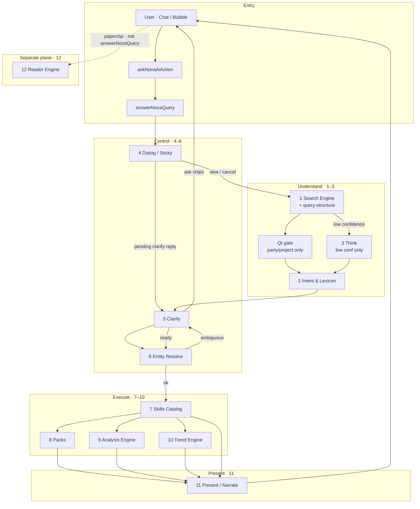
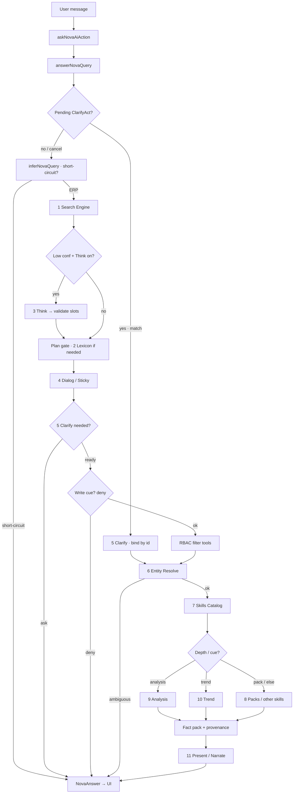
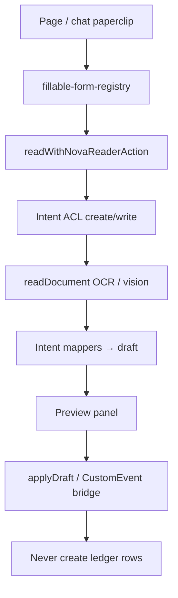

# NOVA engines inventory + flowchart

**Audience:** product + engineering  
**Verdict:** NOVA has **12 engines / planes** (product vocabulary).  
**Sources:** live chat (`answerNovaQuery`), SearchEngine / query-structure, lexicon/intent, DialogState, entity resolve, skills registry, Analysis / Trend, packs, presentation polish, Reader (`readWithNovaReaderAction`).

**Status note (2026-07-14):** QI **person-task** regression (`aalok tasks` → person_fallback vs false party bind) is being recovered on a **sibling tip** — treat party-module / `acceptsPartyEntitySpan` wording in this doc as target behavior; prefer the recovery tip over further docs polish until that tip lands.

NOVA chat = **read-only ERP Q&A** (facts via catalog tools).  
NOVA Reader = **assistive OCR → form prefill** (never posts ledger rows). Shared session/platform gates; Reader does **not** go through `answerNovaQuery`.

---

## Exact count: **12 engines**  
*(unchanged — QI gate is a Search Engine sub-rule, not a 13th engine)*

| # | Engine (product name) | What it does | Primary code |
|---|----------------------|--------------|--------------|
| 1 | **Search Engine** | Rules-first slot fill: family · entity · metric · period · depth · deny_write | `nova-search-engine.ts` + `query-structure/*` |
| 2 | **Intent & Lexicon** | Topic synonyms → canonical tools when SearchEngine is not decisive | `nova-lexicon.ts`, `composeNovaIntent` / `nova-plan.ts` |
| 3 | **Think** | Gated LLM slot polish **only when plan confidence is low** | `nova-think.ts` |
| 4 | **Dialog / Sticky** | Session DST: bound party/project across short module follow-ups; TTL / HR / org-wide clear | `dialog-state.ts` |
| 5 | **Clarify** | Ask-over-guess chips; `"1"` / code / label binds by id (no re-fuzzy) | `nova-clarify.ts`, ClarifyAct in DialogState |
| 6 | **Entity Resolve** | Permission-aware party / staff / project disambiguation (0 · 1 · many · bound id) | `nova-tools.ts` (`resolveNovaEntityHint`) |
| 7 | **Skills Catalog** | Registered read-only ERP skills + RBAC dispatch | `skills/registry.ts`, `runNovaTools` |
| 8 | **Packs** | Multi-metric business chapters (Month, Collection, Project Command, …) | `packs/*`, recipes → pack skills |
| 9 | **Analysis Engine** | “Why is it here?” — factor pack + ranked drivers (+ optional LLM) | `analysis/engine.ts` · skill `nova_analysis` |
| 10 | **Trend Engine** | “Who/what over time?” — windowed series + rankings | `trend/engine.ts` · skill `nova_trend` |
| 11 | **Present / Narrate** | Deterministic format + guarded LLM polish + answer guards | `nova-format.ts`, `presentation/*` |
| 12 | **Reader Engine** | OCR / vision → mapped drafts → form prefill / preview (separate plane) | `nova-reader/*` · `readWithNovaReaderAction` |

### Technical modules (not counted as separate product engines)

| Module | Role | Bundled under |
|--------|------|---------------|
| `query-structure/*` | Shared normalize / depth / gates / entity-module parse | **Search Engine** |
| **QI gate (party/project only)** | Leading `{entity} {module}` / scoped tasks bind **only** when `acceptsPartyEntitySpan` — person-shaped (`aalok tasks`) → person_fallback, never silent org bind | **Search Engine** (sub-box) |
| `inferNovaQuery` + short-circuits | Meta / help / greeting / garbage before plan | Gate before engines 1–3 |
| `buildNovaPlan` / `finalizeNovaPlan` | Single plan gate (SearchEngine vs lexicon/Think) | Bridges 1–3 → 5–7 |
| Write guards + tool RBAC | `deny_write` / `read_only_guard` / `filterNovaToolsForUser` | Control before 6–7 |
| `recipes/*` | Bounded phrase → fixed skill / pack | **Packs** / Skills |
| `semantic/*` (ontology, aliases) | Typed entity vocabulary for resolve | **Entity Resolve** |
| Report plane (`reports/*`) | Immutable `NovaReport` snapshots of pack answers | Satellite of **Packs** |
| Memory / history | Redacted turns; not authority over ledger | Supports **Dialog / Sticky** |
| Finding / answer guards | Post-facts structure + digit/money/identity checks | **Present / Narrate** |

---

## Compact overview (all 12)

---

## Chat plane detail (engines 1–11)

---

## Reader plane (engine 12)

Reader shares platform LLM keys and session gates with chat, but **does not** feed Sticky, Analysis, or Trend.

---

## Related docs

- [`NOVA_FLOWCHART_WITH_READER.md`](./NOVA_FLOWCHART_WITH_READER.md) — chat + Reader sequence diagrams  
- [`NOVA_FLOW.md`](./NOVA_FLOW.md) — live request sketch  
- [`NOVA_FINAL_ARCHITECTURE.md`](./NOVA_FINAL_ARCHITECTURE.md) — commercial hybrid target  
- [`NOVA_ANALYSIS_ENGINE.md`](./NOVA_ANALYSIS_ENGINE.md) · [`NOVA_TREND_PLAN.md`](./NOVA_TREND_PLAN.md)  
- [`../nova-reader/NOVA_READER_ARCHITECTURE.md`](../nova-reader/NOVA_READER_ARCHITECTURE.md)
