# Final proposed NOVA architecture (commercial-ready target)

**Canonical target design** for emPOWER’s read-only ERP assistant. This is the approved hybrid: rules-first understanding, gated Think, DialogState for numbered clarify, dual write guards, bounded recipes, Finding, and post-narration answer guards — **not** a free ChatGPT-with-DB agent.

**Status:** target end-state. Parts already exist on tip **~2.136.x**; DialogState / answer guards / dual write preflight are the main gaps. See labels below and `NOVA_COMMERCIAL_READY_PLAN.md` for the ship roadmap.

---

## Verdict

NOVA is **controlled ERP intelligence**: the user asks in natural language; the system classifies, fills slots, plans only catalog tools, enforces RBAC and read-only, resolves entities (or asks), runs Prisma skills for facts, optionally structures a Finding, then narrates with guards so money/counts/identity/period cannot drift. LLMs never pick tools freely, never write, never run SQL, and never treat chat memory as authority over the ledger. Clarify replies like `"1"` bind a pending **ClarifyAct by id** — they do not re-fuzzy the party name.

---

## Full flow (approved hybrid)

```mermaid
flowchart TD
  UI["User · NovaAiChat / Bubble"]
  ACT["askNovaAiAction<br/>session · ai.assistant.read · quota"]
  LOAD["Load NovaDialogState<br/>+ history fallback"]
  ANS["answerNovaQuery"]

  PEND{"Pending ClarifyAct<br/>TTL ok?"}
  RES["NovaClarifyResolver<br/>1 / code / label / type-deixis"]
  HIT{"Matched option?"}
  BIND["Bind entityId · type · code<br/>clear pending · resume originalQuery"]
  SKIP["Skip fuzzy entity resolve<br/>use bound id"]
  REASK["Re-ask: reply with a number"]
  TOPIC{"Topic switch / meta / standalone?"}
  CLEAR["Cancel pending clarify"]

  INF["inferNovaQuery<br/>meta · erp · follow_up · unclear · garbage"]
  SHORT{"Short-circuit?<br/>help · greeting · access · company · garbage"}
  FU["resolveNovaFollowUp<br/>slot merge when allowed"]

  RULES["NovaSearchEngine rules<br/>runNovaSearchEngine → slots"]
  LOW{"Plan confidence low<br/>and Think gated on?"}
  THINK["NovaThink LLM<br/>NovaSearchSlots JSON"]
  VAL["validateNovaSearchSlots<br/>catalog tools · families · drop invents"]
  SLOTS["NovaSearchSlots<br/>family · entity · metric · period · tools[]"]

  PLAN["buildNovaPlan → finalizeNovaPlan<br/>SearchEngine decisive → else compose"]
  SLOTVAL["Expanded slot validation<br/>family · metric · entity combos"]
  CLARIFY{"Incomplete / ambiguous?<br/>shouldClarifyNovaPlan"}
  RECIPE{"Bounded recipe match?<br/>execution registry"}

  W1["Write preflight<br/>queryFamily deny_write"]
  W2["Post-plan write guard<br/>read_only_guard"]
  DENY_W["Write-deny → use ERP screens"]

  RBAC["RBAC hard / soft deny<br/>filterNovaToolsForUser"]
  DENY_R["rbac_deny / rbac_soft_deny"]

  ENT{"Entity / person resolve<br/>permission-aware"}
  FUZZY{"Soft fuzzy allowed?<br/>not money/sensitive"}
  CLARIFY_UI["Clarify UI + push ClarifyAct<br/>options id·type·code·label"]
  UNMATCH["Unmatched / lexicon stub<br/>catalog_suggest"]

  SKILL["runNovaTools → dispatchNovaSkill<br/>Prisma under can(...)"]
  FACTS["Fact pack + links + provenance"]
  FIND["NovaFinding<br/>observation · evidence · confidence"]
  NARR["Narrate<br/>LLM facts-only or deterministic"]
  AGUARD["Answer guards<br/>money · count · identity · period"]
  OUT["NovaAnswer → UI"]
  MEM["Persist dialogState · redacted turns<br/>T0–T2 memory only"]

  UI --> ACT --> LOAD --> ANS --> PEND
  PEND -->|yes| RES --> HIT
  HIT -->|yes| BIND --> SKIP --> SKILL
  HIT -->|no · short| REASK --> OUT
  HIT -->|no · long| TOPIC
  PEND -->|no| TOPIC
  TOPIC -->|cancel| CLEAR --> INF
  TOPIC -->|no pending path| INF

  INF --> SHORT
  SHORT -->|yes| OUT
  SHORT -->|no| FU --> RULES --> SLOTS
  RULES --> LOW
  LOW -->|yes| THINK --> VAL
  VAL -->|valid| SLOTS
  VAL -->|fail| RULES
  LOW -->|no| SLOTS

  SLOTS --> PLAN --> SLOTVAL --> CLARIFY
  CLARIFY -->|clarify| CLARIFY_UI --> OUT
  CLARIFY -->|stub| UNMATCH --> OUT
  CLARIFY -->|ready| RECIPE
  RECIPE -->|hit| SKILL
  RECIPE -->|miss| W1
  W1 -->|deny| DENY_W --> OUT
  W1 -->|ok| W2
  W2 -->|deny| DENY_W --> OUT
  W2 -->|ok| RBAC
  RBAC -->|denied| DENY_R --> OUT
  RBAC -->|ok| ENT

  ENT -->|bound id present| SKIP
  ENT -->|many / ambiguous| CLARIFY_UI
  ENT -->|unique| FUZZY
  FUZZY -->|exact / safe soft| SKILL
  FUZZY -->|money soft-fuzzy blocked| CLARIFY_UI

  SKIP --> SKILL
  SKILL --> FACTS --> FIND --> NARR --> AGUARD --> OUT --> MEM --> UI
```

---

## Layer summary

| Layer | Role | Engines / gates |
|-------|------|-----------------|
| **Understand** | Classify utterance; fill slots | `inferNovaQuery`, **rules-first** `NovaSearchEngine`, **NovaThink only when low confidence**, `validateNovaSearchSlots` |
| **Plan** | Decide tools + completeness | `buildNovaPlan` / `finalizeNovaPlan`, expanded slot validation, bounded **recipes** |
| **Control** | Safety before any data | Dual **write guards**, RBAC, clarify-over-guess, **NovaDialogState** pending acts |
| **Execute** | Read ERP | `runNovaTools` → skills; bound id skips re-fuzzy; Prisma + `can(...)` |
| **Reason** | Structure what facts mean | **NovaFinding** (evidence-backed; prediction labeled) |
| **Present** | User-visible answer | Deterministic or LLM narrate → **answer guards** (money/count/identity/period) |
| **Learn** | Session continuity only | DialogState + redacted history (**T0–T2**); optional light **NovaUserPrefs** later — **not** NovaMind |

---

## Legend (boxes)

| Box | Role |
|-----|------|
| **NovaDialogState** | Session DST: pending `ClarifyAct`, bound entity ids, TTL, cancel on topic switch. |
| **NovaClarifyResolver** | Matches `1` / code / label / type-deixis against pending options; never re-tokenizes as a new name search. |
| **NovaSearchEngine** | Deterministic rules → slots; always the default / backstop. |
| **NovaThink** | Optional LLM slot fill when confidence is low; same schema; catalog-validated. |
| **validateNovaSearchSlots** | Drops invented tools/families; strips write-shaped tools. |
| **Dual write guards** | Early `deny_write` family + post-plan `read_only_guard`. |
| **Recipes** | Phrase → fixed skill id in execution registry (e.g. collection attention). |
| **Entity resolve** | Permission-aware; no soft fuzzy on money/sensitive when ambiguous. |
| **NovaFinding** | Structured observation + evidence between facts and narration. |
| **Answer guards** | Post-narration checks so ₹ / counts / subject / period match the fact pack. |
| **Memory tiers** | T0 pending acts · T1 session slots · T2 redacted turns · T3 prefs (later) · T4 ERP via skills. |

**Names we reject:** NovaReplySense, NovaMind (implies sticky behavioral / money memory). Prefer **NovaDialogState**, **NovaClarifyResolver**, optional **NovaUserPrefs**.

---

## Target vs live (~2.136.x)

| Piece | Live tip (~2.136.x) | Target |
|-------|---------------------|--------|
| Rules + gated Think | **Exists** — SearchEngine always; Think on low confidence | Keep; document as rules-first |
| Write deny | **Partial** — `read_only_guard` + SearchEngine `deny_write` | Dual explicit preflight + post-plan |
| Recipes / Finding | **Partial** — registry + Finding v1 (Phase F/G) | Polish + wider Finding use |
| Entity clarify cards | **Exists** — prose + chips | **DialogState bind-by-id** (shipping) |
| `"1"` after Tata-style clarify | **Bug** — re-fuzzy loop | Resolver + skip fuzzy |
| History fallback | **Hole** — client sends `[]` when `conversationId` set | Always send client prior; server prefers memory |
| Answer guards | **Partial** — money/identity helpers in LLM path | Formal post-narration guard stage |
| Slot validation expand | **Basic** validate slots | Family/metric/entity combo matrix |
| NovaUserPrefs | **Absent** | Optional P2+; never sticky party/₹ |
| Free SQL / LLM tool pick / silent writes | **Forbidden** — keep | Keep forever |

---

## Related docs

- `NOVA_DIALOG_STATE_PLAN.md` — DialogState research + acceptance tests  
- `NOVA_COMMERCIAL_READY_PLAN.md` — ChatGPT critique + P0–P5 roadmap  
- `NOVA_FLOW.md` — live/request-flow sketch; points here as the final proposal  
