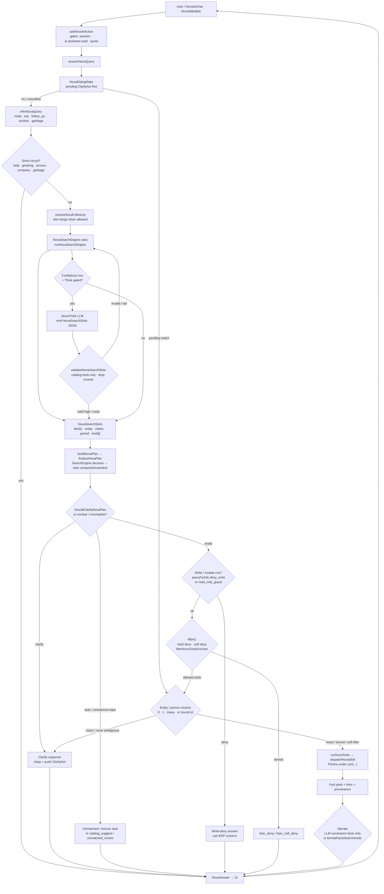

# NOVA request flow

**Canonical final proposal:** [`NOVA_FINAL_ARCHITECTURE.md`](./NOVA_FINAL_ARCHITECTURE.md) (commercial-ready hybrid target + full mermaid).

This file is the **live / tip sketch** (~2.136.x): understand → plan → RBAC → resolve → skills → narrate. It stays aligned with the approved hybrid (rules-first, Think only when low confidence). For DialogState, dual write guards, Finding, and answer guards as an end-state, use the architecture doc.

Read-only ERP assistant: understand the question into slots (NovaThink and/or NovaSearchEngine), plan tools, enforce RBAC, resolve entities, run skills for facts, then narrate — never free SQL or writes.

## Legend

| Box | Role |
|-----|------|
| **User / NovaAiChat · NovaAiBubble** | Chat UI entry; calls the server action, not a free `/api/nova` route. |
| **askNovaAiAction** | Session, platform flag, `ai.assistant.read`, daily quota / concurrency before answering. |
| **answerNovaQuery** | Main orchestrator in `src/lib/ai/nova.ts`. |
| **NovaDialogState** | Pending clarify acts; `"1"` binds by id before re-fuzzy (see architecture doc). |
| **inferNovaQuery** | Classifies meta vs ERP vs follow-up vs unclear vs garbage before planning. |
| **Short-circuit** | Help, greeting, access map, company knowledge, garbage — return without tools. |
| **resolveNovaFollowUp** | Merges underspecified follow-ups onto prior plan slots (no ₹ copy from history). |
| **NovaThink** | Optional gated LLM understand layer (`nova-think.ts`); **only when plan confidence is low**; same slot schema as SearchEngine; read-only. |
| **validateNovaSearchSlots** | Coerces Think (or any candidate) to safe slots: allowed families, registered tool ids only, strips write-shaped tools. |
| **NovaSearchEngine** | Deterministic rules **first** (`nova-search-engine.ts`): search / status / resolve / deny_write / money cues → slots. |
| **NovaSearchSlots** | Shared understand output: `queryFamily`, entity hint/type, metric, period, `tools[]`, confidence. |
| **buildNovaPlan → finalizeNovaPlan** | Single plan gate: decisive SearchEngine tools win; else lexicon/intent compose; period defaults only when ready. |
| **shouldClarifyNovaPlan / unclear** | Prefer ask-over-guess when metric/period/entity incomplete; clarify chips in UI. |
| **Unmatched / lexicon stub** | Topic recognized but no wired tools — stub message or catalog suggest / unmatched review, not a fake skill. |
| **Write-deny** | Create/update/delete/approve cues → `deny_write` / `read_only_guard`; NOVA never mutates. |
| **RBAC** | Hard deny (confidential), soft deny (matched tools all filtered), plus per-tool `novaCanRunTool`. |
| **Entity / person resolve** | Disambiguate parties/staff before money/HR tools; many matches → clarify; bound ClarifyAct id skips fuzzy. |
| **runNovaTools → skill** | Dispatch registered skill handlers; Prisma reads only; handler `can(...)` defense-in-depth. |
| **Fact pack** | Structured facts + links + provenance for narration. |
| **Narrate** | LLM may only summarize retrieved facts (or deterministic formatter / `preferDeterministic` skills). |
| **NovaAnswer → UI** | Answer text, links, `toolsUsed`, optional clarify chips; logged / memory appended after return. |

**Design notes**

- **Rules-first:** SearchEngine feeds `buildNovaPlan` on every plan; Think (`understandNovaQuery`) only when plan confidence is low (and gated on). Rules always backstop invalid/off Think.
- Full commercial target (Finding, answer guards, dual write preflight, DialogState): **`NOVA_FINAL_ARCHITECTURE.md`**.
- Branches that leave the happy path: **write-deny**, **RBAC deny**, **clarify**, **unmatched/stub**.
