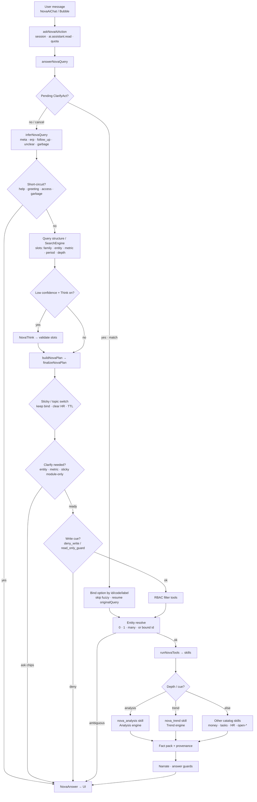
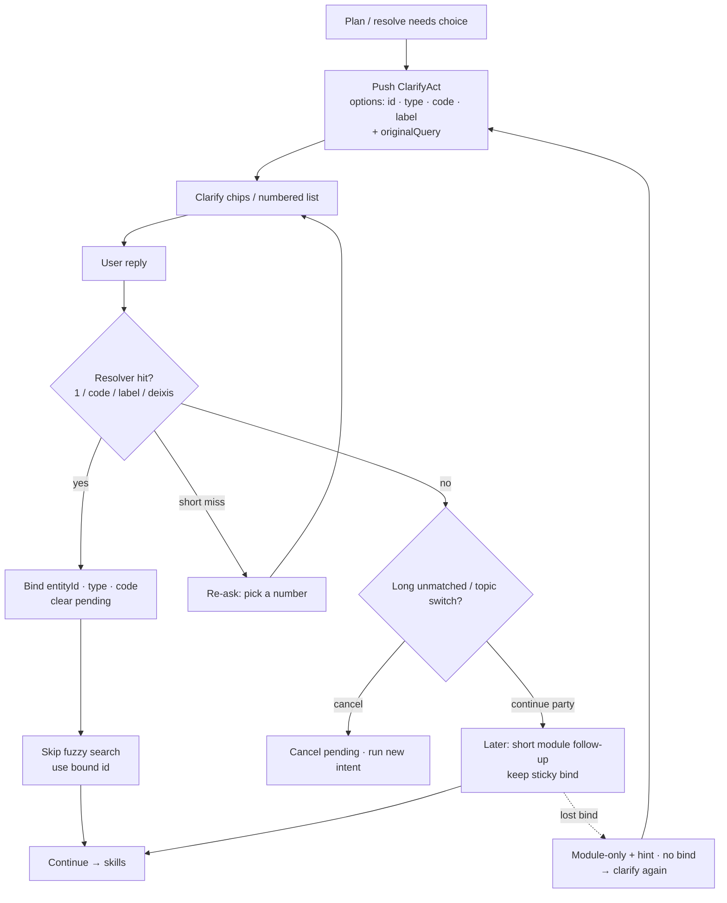
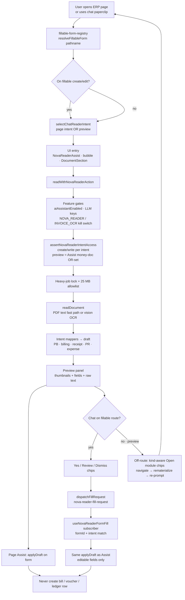

# NOVA system flowchart (with NOVA Reader)

**Audience:** product + engineering  
**Engine count:** **12** product engines — see [`NOVA_ENGINES_FLOWCHART.md`](./NOVA_ENGINES_FLOWCHART.md) for the named inventory.  
**Sources of truth:** live chat path (`answerNovaQuery` / `NOVA_FLOW.md`), DialogState sticky/clarify, Analysis/Trend skills, Reader ACL + fillable registry + CustomEvent bridge (`nova-reader/*`).

NOVA = **read-only ERP chat** (facts via catalog tools).  
NOVA Reader = **assistive OCR → form prefill** (never posts ledger rows). They share session/platform gates and LLM keys in places, but **Reader does not go through `answerNovaQuery`**.

---

## 1. High-level chat plane

User message → intent/structure → resolve → sticky → tools/skills → Analysis/Trend → reply.

### Chat-plane notes

- **Rules-first:** `NovaSearchEngine` (+ shared `query-structure`) fill slots; Think only when plan confidence is low.
- **Sticky:** bound party/project can ride short module follow-ups (`pending tasks`, invoices, …). HR families and self/org-wide cues clear the bind. Module-only follow-up with prior hint but **no** bind → clarify (not silent org-wide).
- **ClarifyAct:** reply `"1"` / code / label binds by id — does **not** re-fuzzy the name.
- **Analysis / Trend:** selected as tools (`nova_analysis` / `nova_trend`) from depth cues or lexicon; still read-only skills under RBAC.

---

## 2. Clarify + entity bind loop

---

## 3. NOVA Reader plane

Page open → Reader ACL → chat bubble / Assist → form fill / CustomEvent bridge → registry.

### Reader ACL (accurate)

| Intent | Gate (authoritative in `read-action`) |
|--------|----------------------------------------|
| `purchase_bill` | `purchasebill.create` |
| `receipt` | `receipt.create` |
| `payment_request` | `paymentrequest.create` |
| `sales_invoice` | `invoice.create` |
| `sales_order` | `salesorder.write` |
| `purchase_order` | `purchaseorder.create` |
| `manual_expense` | accounts dashboard + ADMIN/ACCOUNTANT/SUPER_ADMIN |
| `preview` (chat off fillable page) | **same OR-set as Assist money-doc creates** — not bare `*.read` (Staff money-hide / POL-1) |

Registry `permissionHint` is **UX only**; server `assertNovaReaderIntentAccess` is source of truth.

### Fillable registry + bridge

| Piece | Role |
|-------|------|
| `fillable-form-registry.ts` | Path → `formId` / intent / title / href; `selectChatReaderIntent`; Open-module suggestions by document kind |
| `form-fill-bridge.ts` | In-memory subscriber Map + `nova-reader-fill-request` / `…-result` CustomEvents; retries for mount races; **no sessionStorage drafts** |
| `useNovaReaderFormFill` | Form registers `applyDraft` for matching `formId` + intent |

---

## 4. How Reader relates to main chat

```mermaid
flowchart LR
  subgraph shared["Shared (platform)"]
    PLAT["PlatformSettings.aiAssistantEnabled"]
    LLMK["LLM / vision keys"]
    SESS["Signed-in session"]
  end

  subgraph chat["Main chat plane — answerNovaQuery"]
    DST["DialogState · sticky · ClarifyAct"]
    SE["SearchEngine · Think · plan"]
    TOOLS["Catalog skills · Analysis · Trend"]
    RBAC["ai.assistant.read + tool RBAC"]
    REPLY["Narrated ERP answer"]
  end

  subgraph reader["Reader plane — readWithNovaReaderAction"]
    OCR["readDocument OCR/LLM extract"]
    IACL["Intent ACL create/write"]
    DRAFT["Mapped drafts + preview"]
    FILL["Page-local applyDraft / bridge"]
  end

  shared --> chat
  shared --> reader
  chat -.->|paperclip uses Reader<br/>not answerNovaQuery| reader
  reader -.->|does not feed sticky<br/>or Analysis/Trend| chat
```

| Concern | Main chat | NOVA Reader |
|---------|-----------|-------------|
| Orchestrator | `answerNovaQuery` | `readWithNovaReaderAction` → `readDocument` |
| Goal | Answer questions with facts | Prefill editable forms / show preview |
| Writes | Forbidden (deny_write) | Forbidden (assistive drafts only) |
| Entity memory | DialogState sticky + ClarifyAct | Page-local draft match (vendor/customer lists for mapping) |
| Analysis / Trend | Skills in chat plane | Not used |
| UI | Chat / bubble text | Assist strip, preview panel, bubble CamScanner, fill chips |
| Cross-wire | Bubble paperclip → Reader | Bridge → form `applyDraft` on same tab |

---

## 5. Legend (boxes)

| Box / node | Meaning |
|------------|---------|
| **askNovaAiAction** | Chat entry: session, `ai.assistant.read`, quota before answer. |
| **answerNovaQuery** | Main chat orchestrator (not Reader). |
| **ClarifyAct** | Pending numbered/code choice; bind-by-id, no re-fuzzy. |
| **Query structure / SearchEngine** | Deterministic slots (family, entity, metric, period, depth). |
| **Sticky** | Keep bound entity across short module follow-ups; clear on HR / org-wide / TTL. |
| **nova_analysis / nova_trend** | Read-only depth skills after plan/RBAC/resolve. |
| **fillable-form-registry** | Client path → fill intent for bubble + Open-module chips. |
| **assertNovaReaderIntentAccess** | Server ACL: create/write per intent; preview = Assist OR-set. |
| **readDocument** | Shared OCR pipeline (PDF text fast path or vision). |
| **dispatchFillRequest** | Chat → live form subscriber (CustomEvent + Map). |
| **applyDraft** | Set form fields only; user still saves in ERP. |

---

## Related docs

- [`NOVA_ENGINES_FLOWCHART.md`](./NOVA_ENGINES_FLOWCHART.md) — **12 engines** inventory + compact mermaid  
- [`NOVA_FLOW.md`](./NOVA_FLOW.md) — live chat request sketch  
- [`NOVA_FINAL_ARCHITECTURE.md`](./NOVA_FINAL_ARCHITECTURE.md) — commercial-ready hybrid target  
- [`../nova-reader/NOVA_READER_ARCHITECTURE.md`](../nova-reader/NOVA_READER_ARCHITECTURE.md) — Reader pipeline, surfaces, limits  
