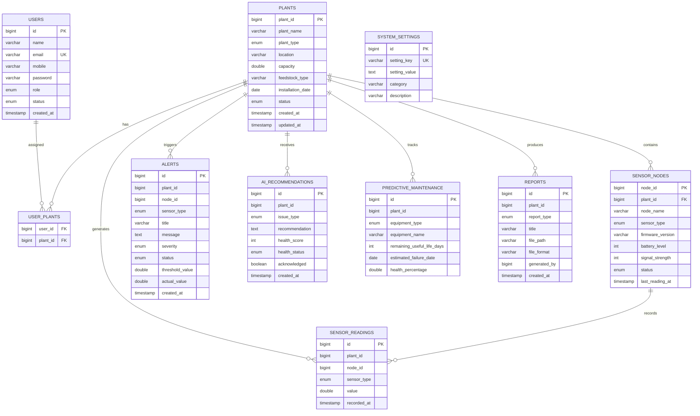

# Database ER Diagram

## Relationships

- **Users ↔ Plants**: Many-to-many via `user_plants` junction table
- **Plants → Sensor Nodes**: One-to-many
- **Sensor Nodes → Readings**: One-to-many (denormalized plant_id on readings for query performance)
- **Plants → Alerts**: One-to-many
- **Plants → AI Recommendations**: One-to-many
- **Plants → Predictive Maintenance**: One-to-many
- **Plants → Reports**: One-to-many

## Indexes

- `sensor_readings(plant_id, recorded_at)` – Analytics queries
- `sensor_readings(node_id, recorded_at)` – Node-level history
- `users(email)` – Unique login lookup
- `system_settings(setting_key)` – Settings lookup
