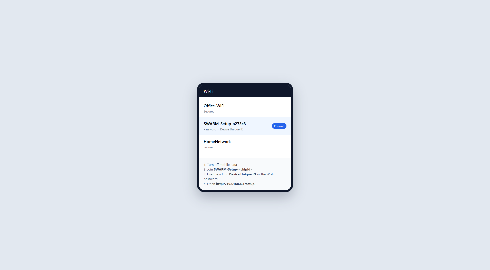
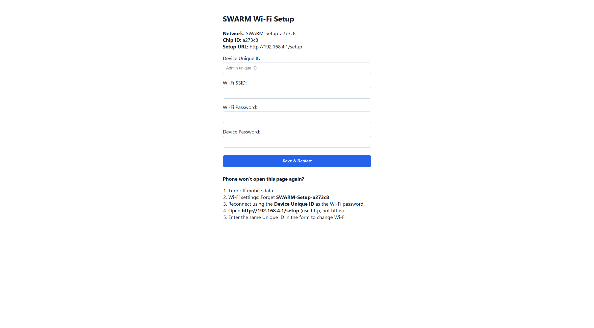
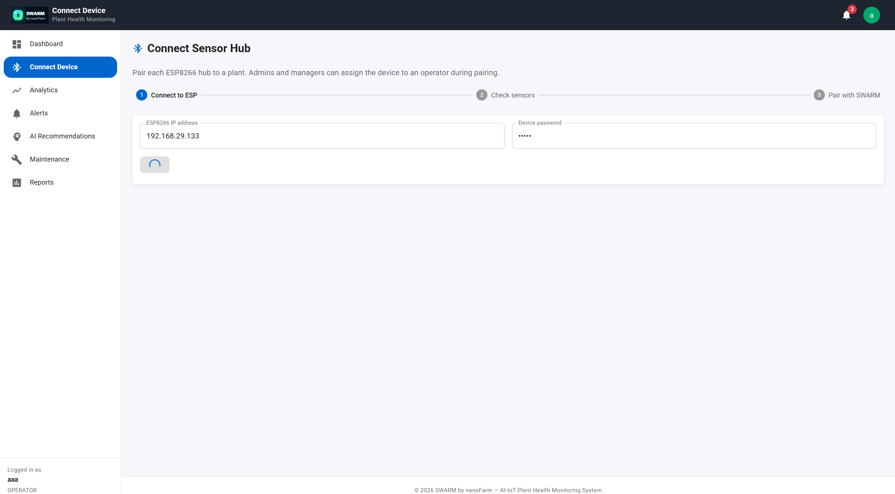
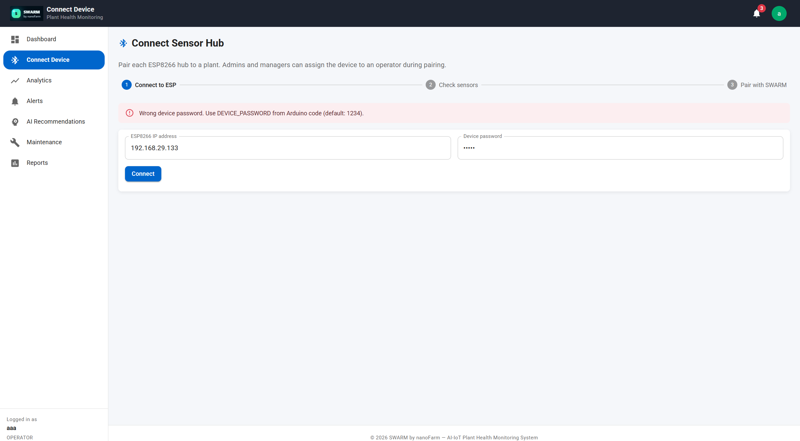
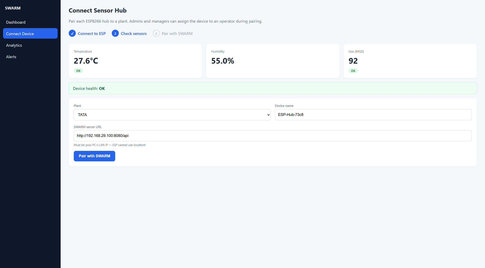
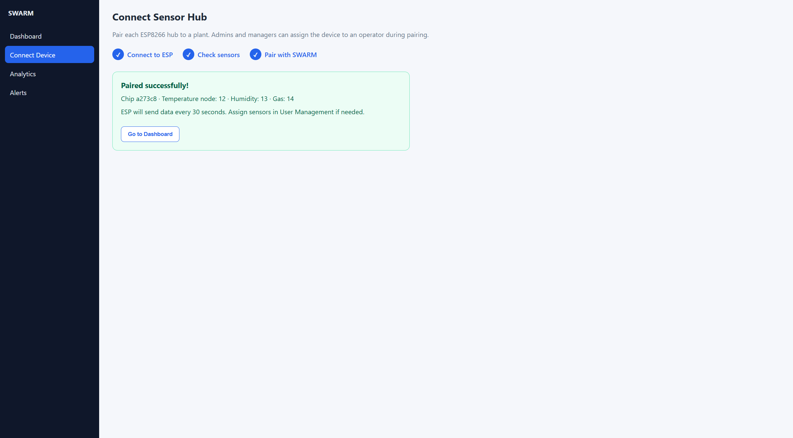
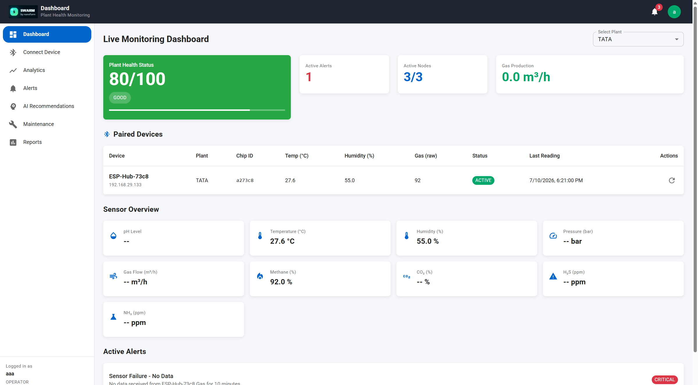

# ESP Sensor Hub Connection Manual

## SWARM by nanoFarm — Temperature & Methane Hub (SWARM MODEL)

This guide covers the full flow: admin first flash → field Wi‑Fi setup with Unique ID → pairing the hub in the SWARM web app → verifying live readings.

Screenshots are stored in [`manual-screenshots/`](./manual-screenshots/) (sharp PNG, no blur).

---

## What you need

| Item | Notes |
|------|--------|
| SWARM MODEL Sensor Hub | DHT11 (temperature/humidity) + MQ5 (methane/gas) |
| USB cable | First flash only (admin) |
| Phone | To join the ESP setup hotspot and set Wi‑Fi |
| PC on same Wi‑Fi as ESP | To open SWARM and pair the device |
| Device Unique ID | Set by admin in firmware (min 8 characters) |
| Device password | Set in firmware /setup (used by SWARM Connect Device) |

---

## Overview (end-to-end)

```text
1. Admin flashes ESP with Unique ID
2. User joins SWARM-Setup-<chipId> hotspot (password = Unique ID)
3. User opens http://192.168.4.1/setup and enters Unique ID + site Wi‑Fi
4. ESP joins site Wi‑Fi and gets a LAN IP (example: 192.168.29.133)
5. In SWARM web app → Connect Device → enter IP + device password
6. Check sensors → Pair with SWARM (LAN API URL, not localhost)
7. Dashboard shows live Temperature / Humidity / Methane
```

---

## Part A — Admin: first flash (one time per board)

1. Open the ESP sketch (`swarm_esp.ino`).
2. Set a **unique ID for this board** (at least 8 characters):

```cpp
const char* DEVICE_UNIQUE_ID = "SWARM-ESP-001";  // change per device
const char* DEVICE_PASSWORD  = "22 22";          // used later in SWARM Connect Device
```

3. Flash the board over USB.
4. Write the Unique ID on a label / give it to the field user.
5. Keep `FORCE_CLEAR_SAVED_WIFI = false` for normal use.

**Security note:** The Unique ID is also the password for the ESP setup hotspot. Without it, other phones cannot join or change Wi‑Fi.

---

## Part B — Field Wi‑Fi setup (phone, no laptop)

Use this when the hub is moved to a new site, or the first time it needs site Wi‑Fi.

### Step B1 — Join the ESP hotspot

1. Power on the ESP.
2. On your phone, **turn off mobile data**.
3. Open Wi‑Fi settings and connect to:

   - Network: `SWARM-Setup-<chipId>` (example: `SWARM-Setup-a273c8`)
   - Password: the admin **Device Unique ID**



### Step B2 — Open the setup page

1. In the phone browser, open: **http://192.168.4.1/setup**
2. Use `http` (not `https`).
3. If the page will not load:
   - Forget the `SWARM-Setup-*` network
   - Reconnect
   - Keep mobile data off
   - Try again

### Step B3 — Enter Unique ID and new Wi‑Fi

Fill the form:

| Field | What to enter |
|-------|----------------|
| Device Unique ID | Exact admin Unique ID |
| Wi‑Fi SSID | Site / office Wi‑Fi name |
| Wi‑Fi Password | Site Wi‑Fi password |
| Device Password | Password used later in SWARM Connect Device |

Click **Save & Restart**.



Wrong Unique ID → Wi‑Fi is **not** changed.

### Step B4 — Confirm the hub is online

After restart, the ESP joins the site Wi‑Fi. On a PC on the same network, open:

`http://<esp-lan-ip>/info`

Example response:


Useful fields:

- `ip` — LAN address to type in SWARM (example `192.168.29.133`)
- `chipId` — hardware id (example `a273c8`)
- `apSsid` — setup hotspot name
- `sensors` — `DHT11`, `MQ5`
- `swarmConfigured` — `true` after pairing with SWARM

---

## Part C — Pair with SWARM web app

PC and ESP must be on the **same Wi‑Fi**. Backend must be reachable on a **LAN IP** (ESP cannot use `localhost`).

### Step C1 — Open Connect Device

1. Login to SWARM (example: `http://localhost:3000`).
2. In the sidebar, click **Connect Device**.


### Step C2 — Connect to ESP

1. Enter **SWARM MODEL IP address** from `/info` (example `192.168.29.133`).
2. Enter **Device password** (from firmware /setup — not the Unique ID).
3. Click **Connect**.



If the password is wrong you will see:



Use the Device Password from Arduino /setup, not the Unique ID.

### Step C3 — Check sensors and pair

After a successful connect you should see live readings, then:

1. Select **Plant**
2. Confirm **Device name**
3. Set **SWARM server URL** to your PC LAN API, for example:

   `http://192.168.29.100:8080/api`

   Do **not** use `http://localhost:8080/api`.
4. Click **Pair with SWARM**



### Step C4 — Success



Click **Go to Dashboard**. The ESP sends Temperature, Humidity, and Methane every ~30 seconds.

---

## Part D — Verify on Dashboard

Open **Dashboard**, select the plant, and confirm:

- Paired Devices row shows Chip ID / IP / readings
- Sensor Overview shows Temperature, Humidity, Methane



---

## Changing Wi‑Fi later (same phone)

1. Turn off mobile data.
2. Forget `SWARM-Setup-<chipId>` in phone Wi‑Fi settings.
3. Reconnect using the **Device Unique ID** as the hotspot password.
4. Open `http://192.168.4.1/setup`.
5. Enter Unique ID again + new SSID/password.
6. Save & Restart.
7. Update the IP in SWARM Connect Device if the LAN IP changed.

---

## Roles & credentials cheat sheet

| Credential | Used for | Who sets it |
|------------|----------|-------------|
| `DEVICE_UNIQUE_ID` | Setup hotspot password + required on `/setup` form | Admin (first flash) |
| Device password | SWARM Connect Device + ESP `/api/status` auth | Admin /setup form |
| Site Wi‑Fi SSID/password | Internet / LAN for ESP | Field user on `/setup` |
| SWARM server URL | Where ESP POSTs `/iot/batch` | Pairing screen (LAN IP) |

---

## Troubleshooting

| Problem | Fix |
|---------|-----|
| Phone cannot open `192.168.4.1/setup` | Turn off mobile data; forget & rejoin hotspot; use `http` not `https` |
| Wrong Unique ID on setup | Wi‑Fi will not save — ask admin for the coded ID |
| SWARM Connect fails / 400 on `api/devices/esp/info` | Wrong IP, device offline, or not a private LAN IP; open `http://<ip>/info` in browser first |
| Wrong device password | Use Device Password from firmware/setup (Unique ID is only for hotspot/setup form) |
| Pairing works but no data | SWARM URL must be LAN IP, not localhost; check Dashboard plant selection |
| `192.168.x.1` fails | That is usually the router, not the ESP |

### About `api/devices/esp/info?ip=...` 400 errors

Those requests come from the **SWARM webapp backend**, not from the ESP URL itself. The backend only accepts private/LAN IPs and then calls `http://<ip>/info` on the device. A 400 means the webapp rejected the probe (invalid IP, unreachable host, or non‑ESP response). Confirm the ESP IP with `/info` first.

---

## Quick checklist

- [ ] Admin set Unique ID (≥ 8 chars) and flashed once  
- [ ] Phone joined `SWARM-Setup-<chipId>` with Unique ID  
- [ ] `/setup` saved site Wi‑Fi with Unique ID  
- [ ] `/info` shows LAN IP  
- [ ] SWARM Connect Device used IP + Device Password  
- [ ] SWARM URL uses LAN IP (`http://192.168.x.x:8080/api`)  
- [ ] Dashboard shows Temperature / Humidity / Methane  

---

## Related docs

- [User Manual (general)](./USER_MANUAL.md)
- [Installation](./INSTALLATION.md)
- [API](./API.md)
